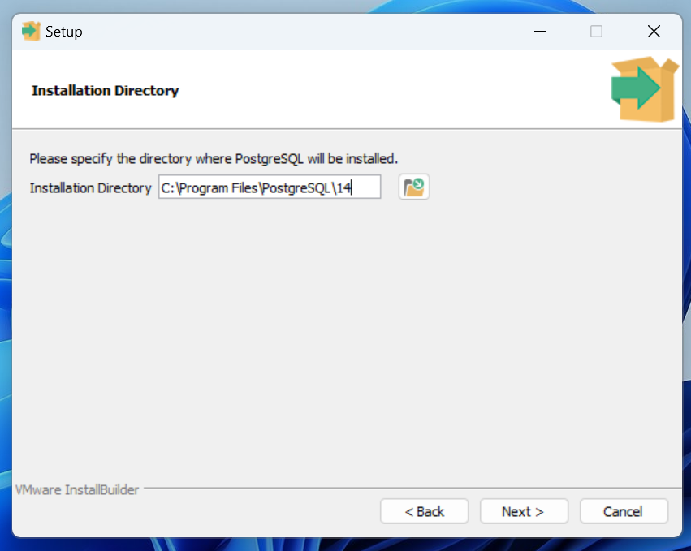
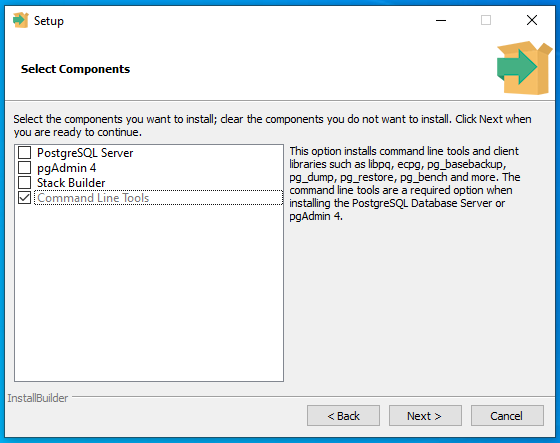
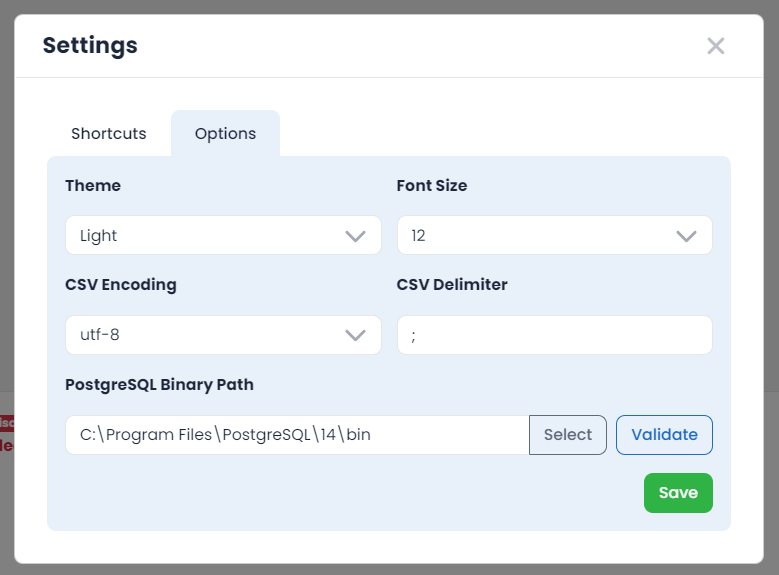
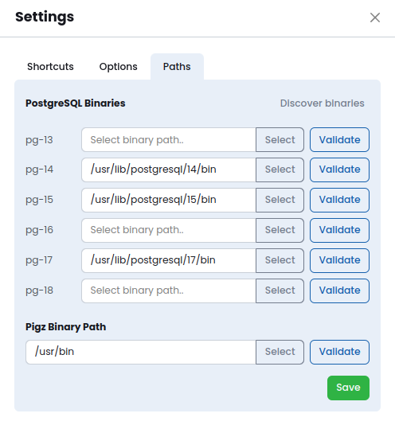
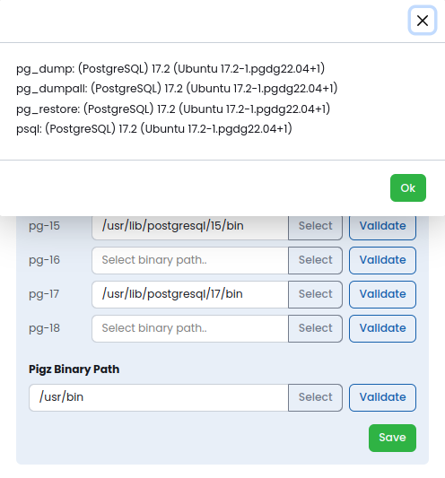

# Installation

> [!NOTE] 
> This section describes the installation procedure for the **Community Edition** of Audax Data Manager.  
> For the AMI or Docker installations, please follow the steps in the [Enterprise Edition](05_enterprise.md) section.

---

## Download and install the app

Download the application distribution file for your platform from the [Github Releases Page](https://github.com/commandprompt/pgmanage/releases).

### Linux

The Linux version of the app is packaged in `.AppImage` format and does not require installation. \
To start using it, just download the `.AppImage` file, make it executable and run it:

```
chmod +x ./pgmanage-$version.AppImage
./pgmanage-$version.AppImage
```


### Windows

Download the application installer executable  
Run the installer and follow the instructions.  
PostgreSQL client utilities, see [Installing Client Utilities on Windows](#installing-client-utilities-on-windows) for the instructions.  
  

### Mac

Download Audax `.dmg` file and open it, a dialog box will appear.  
Drag the Audax icon to your **Applications** folder.  

PostgreSQL client utilities, see [Installing Client Utilities on Mac](#installing-client-utilities-on-mac) for the instructions.  

> [!NOTE] 
> Audax `.dmg` files are not yet notarized, which may prevent them from running on recent macOS releases.  
A workaround for that is to remove the quarantine attribute from PgManage distribution file after downloading it by running: ```xattr -d com.apple.quarantine ./pgmanage-$version_mac_x64.dmg``` command in terminal (assuming that the .dmg file resides in the current directory).


## Install Postgres Client Binaries
Audax relies on Postgresql client binaries to perform database backup and restore operations.
Starting from Audax 1.5, multiple client binary versions are supported.

The application will try to discover the paths automatically by looking up **pg_dump**, **pg_restore**, **pg_dumpall**, and **psql** in directories listed in the $PATH environment variable and some other paths commonly used in various Linux distros. 

**Note:** Autodiscovery of Postgres client binaries is not available on Windows. In order to use the backup and restore features, install the PostgreSQL client binaries and configure binary paths in the application settings.


### Linux

Here is an example on how to install postgres client binaries on Debian / Ubuntu familily of linux distros:
```
sudo apt update
sudo apt install -y postgresql-client-15 postgresql-client-16 postgresql-client-17
```

ℹ️ You may refer to this page for the installation instructions for the specific distro [postgresql.org linux downloads page](https://www.postgresql.org/download/linux/).

Once you have installed your preferred PostgreSQL client versions, [validate your setup](#validating-the-setup) as described below.

### Windows  

You may download Windows PostgreSQL installer from [enterprisedb.com](https://www.enterprisedb.com/downloads/postgres-postgresql-downloads).  
Take note of the installation path where the components will be installed, it will be used below.

  

When prompted which components to install select `command line tools`. PgManage does not need any other components to operate.



TODO: update screenshot


Once you have installed your preferred PostgreSQL client versions, [validate your setup](#validating-the-setup) as described below.

### Mac

To install the client binaries on macOS, there are two options: to install the complete Postgres packages or to only install libpq and then update the $PATH environment variable.

Here is an example on how to install Postgres using Brew:

```
brew install postgresql@[Major version]
```

OR how to install only the client binaries and update $PATH variable to include Postgres client binaries:

```
brew install libpq
echo 'export PATH="/usr/local/opt/libpq/bin:$PATH"' >> ~/.zshrc
```

ℹ️ For more information on how to install Postgres on Mac, refer to the [official Postgres documentation](https://www.postgresql.org/download/macosx/).

Once you have installed your preferred PostgreSQL client versions, [validate your setup](#validating-the-setup) as described below.

---

### Validating the setup

When you run Audax Data Manager for the first time, visit the application settings in `Utilities Menu → Settings → Paths` and verify Postgres binary paths, adjust them if necessary.

You may manually trigger he auto-discovery by clicking `Discover binaries` button.



To test that the provided path is correct, click the `Validate`, for valid configuration the discovered Postgres binary file versions will be shown:

