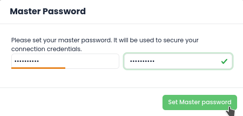
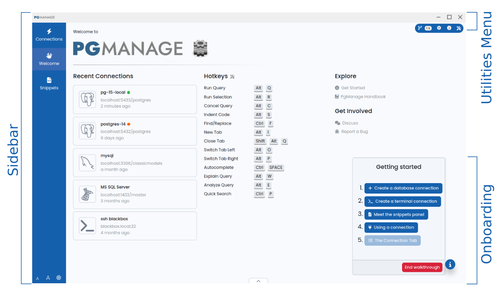
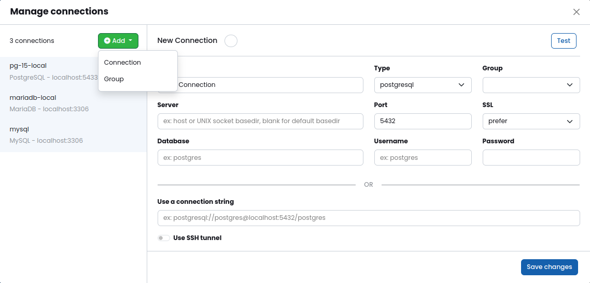

# Quick Start

## Launching the App

When the app starts for the first time, it will ask you to set up a master password.*  
Fill up the provided fields and click the `Set master password` button.  

  

The Master Password is used to encrypt the sensitive data such as database access credentials, SSH keys etc. and will be requested each time you open the application.  

In case if lost, the Master Password may be reset by clicking the `Reset Master Password` button.  

**Note:** resetting the master password will erase all the information that was encrypted with it, including database connection credentials.  
**Note:** Web-based installations (Audax Enterprise) do not rely on the Master Password for credential protection and will not prompt for one.  

👋 Welcome to Audax Data Manager

The home screen shows your recently used connections, hotkey configuration and some useful links for external resources.
You can click any of your recent connections to quicky connect to the particular database.
The small icon near the *Hotkeys* allows to quickly access hotkey customization dialog.

To get started, you may press the `i` icon on the bottom-right to launch the interface onboarding.

The utilities menu at the top-right corner allows you to access the application settings, view the application version and general application info.

The sidebar allows you to manage connections, switch between active database workspaces and access the code snippets panel. It also has a quick access to theme and font settings at the bottom. These features will be discussed later in this documentation.

---

## Create your first database connection

Open the Connection Management window by clicking the ⚡ icon on the sidebar:

Connections and Connection Groups are shown on the left. Clicking on the left panel items shows the item’s view/edit form.  
To create a new database connection click on `➕ Add` → `Connection`. Set the title and connection type; the rest of the form will change depending on the type selected. Fill in the rest of the database connection properties.

Alternatively, the connection string may be used to establish a database connection.  
The password field is optional. If you leave it empty, the password prompt will be shown each time when establishing the connection.  

💡 For PostgreSQL connections, PgManage will also try to retrieve the connection password from the **.pgpass** file before showing the password prompt.

There are two special connection types, which behave differently from the rest:

- **SQLite connections** do not need any other settings besides the Sqlite3 file path.
- **Terminal connections** are shell/console sessions with a remote host. These connections require SSH properties to be filled-in.

### SSH Tunnelling

In addition to direct database connections, PgManage can also connect to database servers via an SSH tunnel. This feature is useful when the database server is not directly accessible, but can be accessed via an intermediate SSH server host. To use SSH tunneling toggle the corresponding switch and enter the SSH credentials for the intermediate host.

### Testing and Saving the Connection

The connection properties can be validated before saving the connection. To do so, click the `Test` button on the top of the connections dialog. If the test is successful, click `Save`.

### Connection Groups

Related connections can be grouped by clicking the `➕ Add` button and selecting the `Group` option. In the Group form, enter a name for the new connection group and select the connections to be grouped; click `Save`. You may also group/ungroup a particular connection from the connection edit form by selecting the corresponding option in the Group dropdown.

### Connection Cloning

Connection cloning can be used to create a new connection based on existing one. To clone a connection, select it on the sidebar and click the `Clone` button. A new conection will appear, pre-populated with the properties of the original connection. Adjust connection properties, enter a new unique name and click `Save`.

---

## Connect to the Database

You can access existing connections in several ways:

- from the **connections menu**: click the `⚡` icon on the left sidebar.
- from the **connection management dialog**: select the connection item on the left, then click the `Connect` button.
- from the Welcome Screen, by clicking one of the items in **Recent Connections** section.