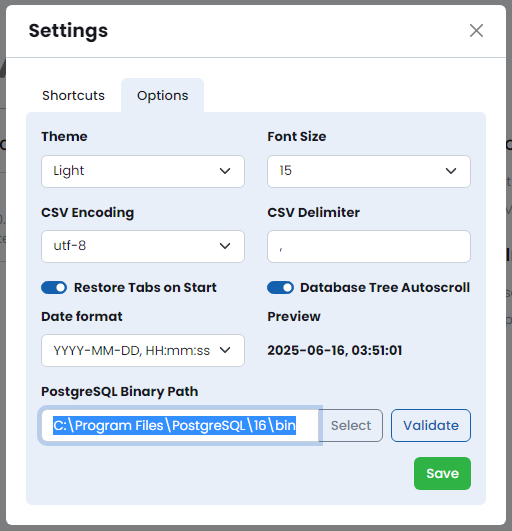

# Quick Start


## Installation

Download the PgManage distribution file for your platform from the [Github Releases Page](https://github.com/commandprompt/pgmanage/releases).

### Linux

PgManage for Linux is packaged in `.AppImage` format and does not require installation. \
To start using the app just download the `.AppImage` file, make it executable and run it:

```
chmod +x ./pgmanage-$version.AppImage
./pgmanage-$version.AppImage
```


### Windows

Download PgManage installer executable  
Run the installer and follow the instructions.  
> _**Note:**_ to install PostgreSQL client utilities, follow the steps in the [Installing Client Utilities on Windows](#installing-client-utilities-on-windows) section.  
  

### Mac

Download PgManage `.dmg` file click on it, a dialog box will appear.  
Drag the PgManage icon to the **Applications** folder.  

> _**Note:**_ to install PostgreSQL client utilities, follow the steps in the [Installing Client Utilities on Mac](#installing-client-utilities-on-mac) section.  
> _**Note:**_ PgManage `.dmg` files are not notarized yet which may prevent them from running on latest OSX releases.  
A workaround for that is to remove the quarantine attribute from PgManage distrubution file after downloading it by running: `xattr -d com.apple.quarantine ./pgmanage-1.3_mac_x64.dmg` command in terminal (assuming that the .dmg file reside in the current directory).


---

### PostgreSQL Client

When PgManage starts, it will try to automatically find PostgreSQL client executable files for the `pg_dump`, `pg_restore`, `pg_dumpall`, and `psql` commands. 
For cases in which this auto-discovery does not work or is not desired, a path to the binaries may be specified in the application settings (**Utilities Menu → Settings**):


To test that the provided path is correct, you may click the `validate` button which will display discovered Postgres binary file versions:


> _**Note:**_ The autodiscovery of client binaries is not available on Windows. The only way to use the backup and restore features is to manually install the PostgreSQL client utilities and configure binary path manually.

#### Installing Client Utilities on Windows
You may download Windows PostgreSQL installer from [enterprisedb.com](https://www.enterprisedb.com/downloads/postgres-postgresql-downloads).  
Take note of the installation path where the components will be installed, it will be used below.

  


When prompted which components to install select `command line tools`. PgManage does not need any other components to operate.


Once installation completes, set the binary path in PgManage settings. Click `Validate` to verify that Postgres binare can be found.




#### Installing Client Utilities on Linux:

Setting up path to PostgreSQL client binaries is usually not necessary for Linux systems because it will be automatically discovered from the $PATH environment variable. Still, there are some cases in which the path autodiscovery may fail:

- if multiple versions of the PostgreSQL client binaries are installed  
- if the PostgreSQL client binaries are installed in a location not included in the $PATH environment variable  

Once you have installed your preferred PostgreSQL’s version, you can set the binaries path `Utilities Menu → Settings`.

> _**Note:**_ You may install PostgreSQL for your particular Linux distribution on [postgresql.org linux downloads page](https://www.postgresql.org/download/linux/).

#### Installing Client Utilities on Mac

To install the client binaries on MacOS, there are two options: to install the complete Postgres packages or to only install libpq and then update the $PATH environment variable.

Here is an example on how to install Postgres using Brew:

```
brew install postgresql@[Major version]
```

OR how to install only the client binaries and update $PATH variable to include Postgres client binaries:

```
brew install libpq
echo 'export PATH="/usr/local/opt/libpq/bin:$PATH"' >> ~/.zshrc
```

Once your preferred PostgreSQL’s version is installed you can set the binaries path `Utilities Menu → Settings`.

> **Note:** For more information on how to install Postgres on Mac, refer to the [official Postgres documentation](https://www.postgresql.org/download/macosx/).

---

### Oracle Support

A note about extra dependencies for Oracle support.

---

## Launching the App

When PgManage starts for the first time, it will ask you to set up a master password.  
Fill up the provided fields and click the `Set master password` button.  

  

The Master Password is used to encrypt the sensitive data such as database access credentials, SSH keys etc. and will be requested each time you open the application.  

In case if lost, the Master Password may be reset by clicking the `Reset Master Password` button.
> _**Note:**_ resetting the master password will erase all the information that was encrypted with it, including database connection credentials.


👋 Welcome to PgManage


To get started, you may press the `i` icon on the bottom-right corner to access Interface Walkthrough.

The utilities menu at the top-right corner allows you to access the application settings, view the application version and general application info.

The sidebar allows you to manage connections, switch between active database workspaces and access the code snippets panel. These features will be discussed later in this documentation.


---

## Creating your first database connection

Open the Connection Management window by clicking the ⚡ icon on the sidebar:


Connections and Connection Groups are shown on the left. Clicking on the left panel items shows the item’s view/edit form.  
Click on `➕ Add → Connection`. Set the title and connection type; the rest of the form will change depending on the type selected. Fill in the rest of the database connection properties.

> _**Note:**_ Alternatively, the connection string may be used to establish a database connection.

There are two special connection types, which behave differently from the rest:

- **SQLite connections** do not need any other settings besides the Sqlite3 file path.
- **Terminal connections** are shell/console sessions with a remote host. These connections require SSH properties to be filled-in.

> **Note:** the password field is optional. If you leave it empty, the password prompt will be shown each time when establishing the connection. For PostgreSQL connections, PgManage will also try to retrieve the connection password from the `.pgpass` file before showing the password prompt.

### SSH Tunnelling

In addition to direct database connections, PgManage can also connect to database servers via an SSH tunnel. This feature is useful when the database server is not directly accessible, but can be accessed via an intermediate SSH server host. To use SSH tunneling toggle the corresponding switch and enter the SSH credentials for the intermediate host.

### Testing and Saving the Connection

The connection properties can be validated before saving the connection. To do so, click the `Test` button on the top of the connections dialog. If the test is successful, click `Save`.

### Connection Groups

Related connections can be grouped by clicking the `➕ Add` button and selecting the `Group` option. On the `Group` form, enter a name for the new connection group and select the connections to be grouped; click `Save`. You may also group/ungroup a particular connection from the connection edit screen by selecting the corresponding option in the `Group` dropdown.

### Connection Cloning

Connection cloning can be used to create new connection based on existing one. To clone a connection select it on the sidebar and click the `Clone` button. A new conection will be shown up, pre-populated with the properties of the original connection. Adjust connection properties, set a new unique name and click `Save`.

---

## Connecting to the Database

You can access existing connections in several ways:

- from the **connections menu** by clicking the ⚡ item on the left sidebar.
- from the **connection management dialog** by clicking the connection item on the left. Then, click the `Connect` button.
- from the Welcome Screen, by clicking one of the items in Recent Connections section.