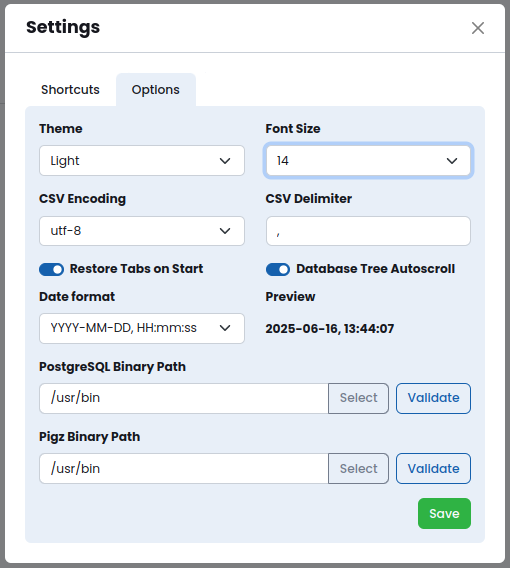
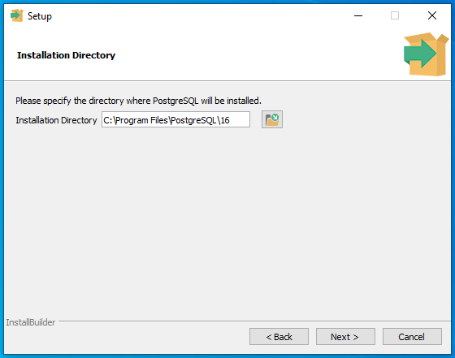

# Quick Start


## Install Guide

Download the PgManage distribution file for your platform from the [Github Releases Page](https://github.com/commandprompt/pgmanage/releases).

### Linux

PgManage for Linux is packaged in `.AppImage` format and does not require installation. \
To start using the app just download PgManage's `.AppImage` file, make it executable and run it:

```
chmod +x ./pgmanage-$version.AppImage
./pgmanage-$version.AppImage
```


### Windows

Download PgManage installer executable  
Run the installer and follow the instructions.  
**Note:** to install PostgreSQL client utilities, follow the steps in the [Installing Client Utilities on Windows](#installing-client-utilities-on-windows) section.  
  

### Mac

Download PgManage `.dmg` file click on it, a dialog box will appear.  
Drag the PgManage icon to the **Applications** folder.  

**Note:** to install PostgreSQL client utilities, follow the steps in the [Installing Client Utilities on Mac](#installing-client-utilities-on-mac) section.  

---

### PostgreSQL Client

When PgManage starts, it will try to automatically find PostgreSQL's client executable files for the `pg_dump`, `pg_restore`, `pg_dumpall`, and `psql` commands. 
For cases in which this autodiscovery does not work or is not desired, a path to the binaries may be specified in the application settings (**Utilities Menu → Settings**):



To test that the provided path is correct, you may click the `validate` button which will display discovered Postgres binary file versions:


**Note:** The autodiscovery of client binaries is not available on Windows. The only way to use the backup and restore features is to manually install the PostgreSQL client utilities.

#### Installing Client Utilities on Windows

- You may download Windows PostgreSQL installer from [enterprisedb.com](https://www.enterprisedb.com/downloads/postgres-postgresql-downloads).
- Take note of the installation path where the components will be installed.



- The installer will ask what components to install. PgManage only needs the `command line tools` part of the package to function.


- Finally, set the binary path in PgManage settings. Notice that the binary files are inside the `bin` folder.


#### Installing Client Utilities on Linux:

Setting up paths to PostgreSQL client binaries is not necessary for Linux systems because these will be automatically discovered in the $PATH environment variable. Still, there are some cases in which the path autodiscovery may fail:

- if multiple versions of the PostgreSQL client binaries are installed

- if the PostgreSQL client binaries are installed in a location not included in the $PATH environment variable

Once you have installed your preferred PostgreSQL’s version, add the path of the binaries in `Utilities Menu → Settings`.

> **Note:** You may install PostgreSQL for your particular Linux distribution on [postgresql.org](https://www.postgresql.org/download/linux/).

#### Installing Client Utilities on Mac

To install the client binaries in MacOS, there are two options: to install the complete Postgres packages or to only  install libpq and then update the PATH.

To install the complete Postgres’s packages run the following command:

```
brew install postgresql@[Major version]
```

To install only the binaries and update the PATH variable, run the following commands:

```
brew install libpq
echo 'export PATH="/usr/local/opt/libpq/bin:$PATH"' >> ~/.zshrc
```

Once you have installed your preferred Postgres version, add the path to the binaries in the application settings.

> **Note:** For more information on how to install Postgres on Mac, refer to the [official Postgres documentation](https://www.postgresql.org/download/macosx/).

---

### Oracle Support

A note about extra dependencies for Oracle support.

---

## Launching the App

When the application starts for the first time, it will prompt a message to set up a master password.
Fill up the provided fields and click the `Set master password` button.  
  


This password will be used by PgManage to encrypt the sensitive data such as database access credentials and SSH keys etc.
The Master Password will be requested the next time you open the application.  

In case if lost, the Master Password may be reset by clicking the `Reset Master Password` button.
> **Note:** resetting the master password will erase all the information that was encrypted with it, including database connection credentials.


Next, you will be greeted with the application welcome page:


To get started, you may press the information icon on the bottom-right corner to access Interface Walkthrough.

The utilities menu is located at the top right corner. From there, you may access the application settings, view the application version, and general application info.


On the sidebar, one can manage connections, switch between active database sessions, and access the snippets, which will be discussed later in this documentation.


---

## Creating your first DB connection

Access Connection Management window by clicking the ⚡ icon on the sidebar, the connection management UI will be shown:


Connections and Connection Groups are shown on the left. Clicking on the left panel items shows the item’s view/edit form. Click on `➕ Add → Connection`. Set the connection title and type; the rest of the form will change depending on the type selected. Fill in the rest of the database connection properties.

> **Note:** Alternatively, the connection string may be used to establish a database connection.

There are two special connection types, which behave differently:

- **SQLite connections** do not need any other settings besides the sqlite3 file path.
- **Terminal connections** are shell/console sessions with a remote host. These connections require setting SSH properties to be filled-in.

> **Note:** the password field is optional. If you leave it empty, the password prompt will be shown each time before establishing the connection. For PostgreSQL connections, PgManage will also try to retrieve the connection password from the `.pgpass` file before showing the password prompt.

### SSH Tunnelling

In addition to direct database connections, PgManage can also connect to the database server via an SSH tunnel. This feature is useful when the database server is not directly accessible, but can be accessed via an intermediate SSH server host. To use SSH tunneling toggle the corresponding switch and enter the SSH credentials for the intermediate host.

### Testing and Saving the Connection

The connection properties can be validated before saving the connection. To do so, click the `Test` button on the top of the connections dialog. If the test is successful, click `Save`.

### Connection Groups

Related connections can be grouped by clicking the `➕ Add` button and selecting the `Group` option. On the `Group` form, enter a name for the new connection group and select the connections to be grouped; click `Save`. You may also group/ungroup a particular connection from the connection edit screen by selecting the corresponding option in the `Group` dropdown.

---

## Connecting to the Database

You can access existing connections in several ways:

- from the **connections menu** by clicking the ⚡ item on the left sidebar.
- from the **connection management dialog** by clicking the connection item on the left. Then, click the `Connect` button.
- from the Welcome Screen, by clicking one of the items in Recent Connections section.