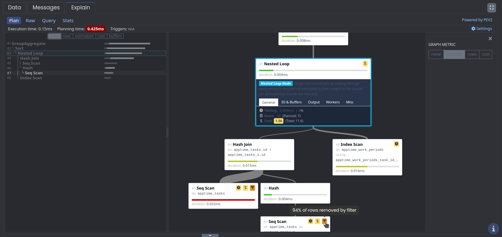
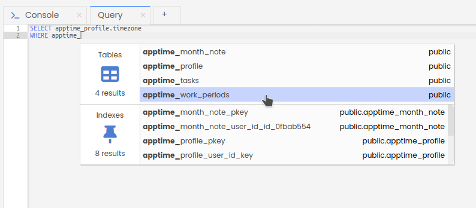
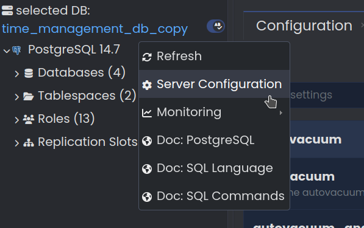
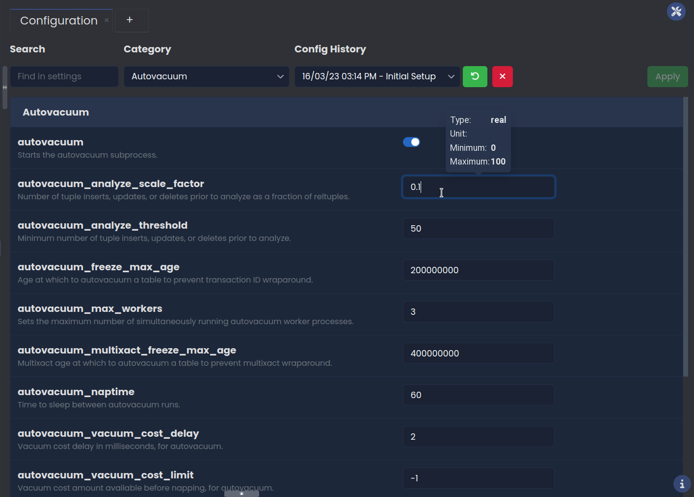
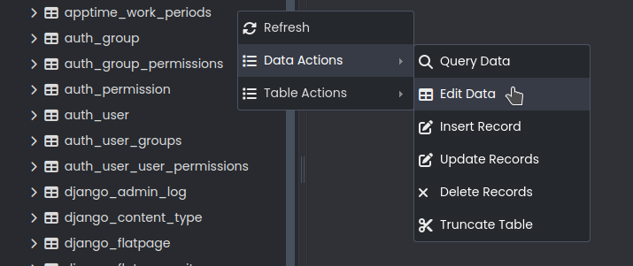
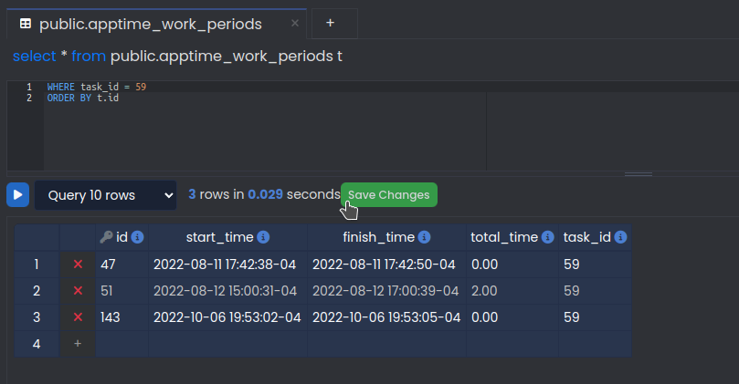
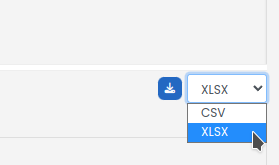

# User Guide

---

## DB Entity Tree and Context Menus

The DB entity tree displays all of the database objects inside a server and is located at the right once a database connection is created.

The **context menus** can be accessed by right clicking on one of the tree nodes. The context menus allow you to make actions to the database. 

---

## Tabs for Different Operations (Query, Monitoring, Console, and Backends)

At the right of the DB entity tree, the operation tabs are used to edit and execute the actions selected on the entity tree. A new tab can be opened by clicking on the plus sign on the tabs panel. There are four kinds of tabs:

**Query tab:** SQL queries can be written and executed to the database. Below the tab, there are four buttons: run, indent SQL, command history, explain, and the explain analyze. The run button executes the query and displays the selected rows at the button right of the application. The indentation feature rewrites the query with standard indentation. The command history opens a menu where one can see executed queries at different time frames. The explain and analyze buttons provide information about the execution and planning time of the query, as well as information about the cost and filtering of rows. The information in the explain features will be displayed in a graph or in tabular form.

**Console tab:** Though the application allows to alter the database objects through the entity tree, a console may also be used to write commands directly.

**Monitoring dashboard:** The monitoring tabs display graphs with the following information:

- Transaction Rate
- Backends
- Autovacuum Workers Usage
- WAL Production Rate
- Temp Files Creation Rate
- Autovacuum Freeze
- Blocked Locks
- Database Size
- Database Growth Rate
- Heap Cache Miss Ratio
- Index Cache Miss Ratio
- Seq Scan Ratio
- Long Transaction
- Long Query
- Long Autovacuum
- Checkpoints
- Bloat: Top 20 Tables
- In Recovery
- Autovac Freeze: Top 20 Tables
- Database Size
- Backends
- Activity

The number of graphs displayed can be controlled by clicking on `Manage units` and selecting the desired graphs. Personalized monitor units may be created by `Manage units → new unit`. This will open a new tab where the name, type, refresh interval, and template can be specified. Once a template has been selected, you may edit the script on the text editor beneath it.

**Backends:** The backends tab displays a table with information about ports, addresses, events, and database activity.

---

## Snippets

The snippets panel can be accessed by clicking on the snippet symbol on the right side menu. You may write code on the text editor and save it. The indentation feature will automatically rewrite the SQL in a pattern.

To use a saved snippet, open a query tap and right click on the text editor. Here you may use, overwrite, or create a snippet.

---

## Command History

The command history is available in the query and console tabs. It displays a list of previously executed queries/commands in a given time range. To copy a query from the history, right click and select `Copy Content To Query Tab`.

---

## Explain

The **Explain** and **Explain Analyze** features provide a visualization of the PostgreSQL execution plan for a query. The Explain feature provides the visualization with cost information while the Explain Analyze feature provides extra information -- such as time, number of rows filtered, and buffers. 

You may access the graph metrics by clicking on `Settings` at the top right. This allows to display information about cost, time, and rows. Next, you may click on a graph node to display more information about it. Finally, zoom in and out of the graph with the scroll wheel.

---

## Code Autocompletion

To aid at typing speed, the application will suggest tables or indexes to autocomplete the query.

---

## PostgreSQL Configuration Management

To access the server configuration for a PostgreSQL connection, right click on the server object on the DB entity tree and select `Server Configuration`.

A new tab will open with the server configuration settings. You may search for a particular setting, choose a category, or revert a configuration with the `Config History` drop down menu. After making the desired changes to the configuration click `Apply` to save the configuration. A message will appear confirming the changes made and asking for an optional comment. Once committed, the new configuration should appear in the `Config History` drop down menu.

---

## Data Editor Grid

The data editor grid allows editing the data of a specified query in a visual format. This feature can be accessed by right clicking on a table in the DB entity tree.

Then, a new tab will be created with a default query of `select * from mytable t`. A text editor allows to add further conditions to the query.

The data editor grid allows the following changes:
- Delete a row: click on the `x` icon and the selected rows will become red.
- Edit cells: double click on a data cell to edit the grid. Or, `right click → Edit Content` to open a separate editor.
- Displayed rows: click on the `Query Rows` drop down menu and select the number of desired rows.

Once the desired changes are done, click on the `Save` button.

---

## Exporting Query Data

Once a query has been entered, the resulting data can be exported into `.CSV` and `.XLSX` files. To export data, select the format at the button right of the query tab and click the download button.

Finally, save the file under the data tab.

---

## SQL Templates

The application automatically creates a template for actions selected in the DB Entity Tree. 
For example, a new record can be created by right clicking on a table object and selecting `Data Actions → Insert record`. For a given table, the following text was generated in a query tab:

Once the desired information has been filled out, the query may be executed with the `run` button and a `INSERT 0 1` message will be displayed at the Data tab.

> **Note:** In future releases, this feature is planned to be re-implemented in an user interface.