# User Guide

## Interface Overview


### Database Explorer and Context Menus

The Database Explorer tree on the left side of the workspace displays the objects inside a server once a database session is established.   

Most of the tree items have a context menu with a list of actions available for that item. The context menu can be accessed by right-clicking on the tree node.

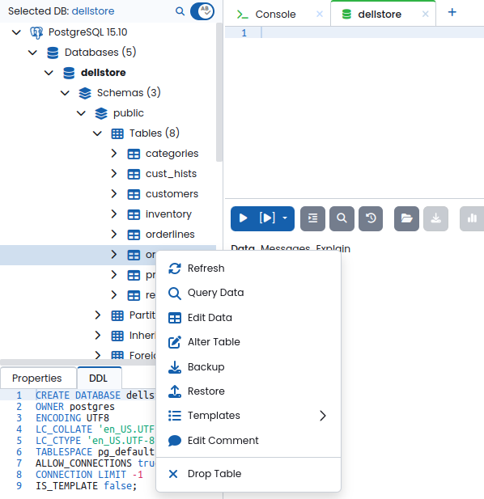

💡 The properties of the currently selected DB object and its SQL definition are shown in  **Properties/DDL** tabs at the bottom of the Database Explorer

#### Quick Search
The Quick Search feature allows you to find any item rapidly and jump directly to its location in the tree view.

**To open the Quick Search dialog:**  
Click the magnifying glass icon at the top of the Database Explorer.
Use the default hotkey: `Ctrl-P` (Windows/Linux) or `Cmd-P` (macOS)

**Using Quick Search:**  
Type the name of the item you want to find in the search box.  
Click an item from the results list to reveal and highlight it in the Database Explorer tree view.  


#### Pinning Databases
Frequently used databases can be pinned to the top of the Database Explorer for quick access.  
To pin a database, hover your mouse cursor over the database node and click the Pin icon that appears.

#### Keyboard Navigation
The Database Explorer supports full keyboard navigation, matching the behavior of standard file explorers and IDEs:  

**Up / Down:** Move the selection cursor to the previous or next node.  
**Left / Right or Enter:** Collapse or expand the selected node.  
**Context Menu Key:** Open the right-click context menu for the selected node.  


### Database Operation Tabs

The area to the right of the Database Explorer contains the operation tabs. There are several types of tabs, the most common being:
  - **Query:** used to edit and execute queries, view and export query results and analyze query performance.
  - **Database Console:** provides a command line interface for the database
  - **Monitoring Dashboard:** displays various performance metrics of the database server.
  - **Backends:** displays active database connections and allows you to terminate a specific database session.

 The tabs listed above can be opened by clicking on the `➕` sign on the tabs panel.  
 Other tabs like ERD, Schema Editor, Backup, Server Configuration etc.
 can be opened using context menus of Database Explorer.

## Querying the database

Open the Query tab.
The top area of the tab contains the SQL editor. The toolbar in the middle allows you to access frequently used actions such as running the entire query or its selected part, formatting SQL code, import/export SQL code from files, etc. The bottom part of the screen displays the query result data-grid and query plan visualizer (available for PostgreSQL only).

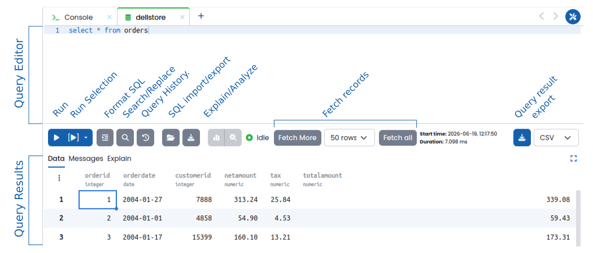

### Editing the code
The query editor supports syntax highlighting, code completion, code folding, and formatting for most common SQL dialects.  

The code completion operates in live mode by default, providing suggestions as you type.  You can disable live completion for the current connection by toggling the `AB` switch at the top of the Database Explorer.  
You can also trigger autocomplete manually using a hotkey  (`Ctrl-Space`  or `Cmd-Space` by default).

To auto-format your code, click the **Format SQL** button or use the hotkey  (`Alt-S` by default)

💡 The script in the editor can be saved to a file or loaded from file using the **Save To file** and **Load From File** buttons on the toolbar.  
💡 SQL scripts can also be imported by dragging the file to the editor

### Running the query
The query can be executed by clicking the ` ▶ ` (Run) button on the toolbar.
The `[▶︎]` (Run Selection) button allows you to execute the selected part of the code in the query editor, if no code is selected the code line where the cursor is will be executed. Alternatively, the selected region of the code can be executed via the context menu of the editor.

Once the query is executed its output will be displayed in the query results data-grid. Query results with more than 50 rows, are loaded in chunks, click `Fetch More` or `Fetch All` respectively to load the next chunk or complete query result; the number of next rows to be fetched can be selected from the drop-down list. 

Query errors returned by the database will be shown as red annotations to the left of the query line that caused the error. Hover the mouse pointer over the annotation to reveal error details.

### Working with query results
The contents of query results data-grid can be copied to clipboard. First, select the rows, cells or a specific region of the grid, then right-click  the selection and choose the corresponding option from the context menu.  

💡 You can select whole rows or columns by clicking on the row number or the column name respectively

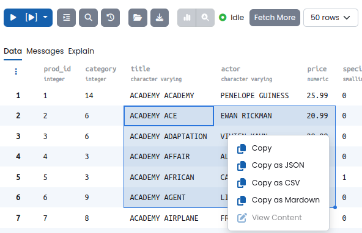

The contents of an individual data-grid cell can be viewed in a pop-up window. This is especially useful with cells containing large amounts of data. To view the contents of the cell either double-click on it or select the `View Content` option of its context menu.  

The query result data can be exported to a file by selecting the desired export format in the drop-down (XLSX, CSV, or JSON) and clicking the `📥`(Export Data) button.

💡 Data-grid columns can be quickly maximized/minimized by double-clicking the corresponding column header.  
💡 Hover over the data-grid header to reveal column resize controls.  
💡 Click on the `⋮` to the left of data-grid header to reveal grid layout menu  


### Re-running previous queries
Audax keeps the history of previously executed queries. The history can be searched and filtered by date range and the database against which the query was executed.  

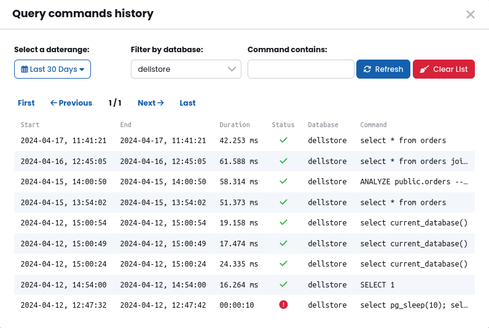

Click the `Query History` button to bring up the history modal.  
Right-click on the cell of **Command** column of the history record and select the `Copy Content to Query Tab` context menu option. Alternatively, just double-click on the particular cell of the Command column.

💡 History records are deduplicated, if you run the exact same query multiple times in a row, only the most recent execution record is saved.  

### Visualizing the query execution plan
Audax can visualize query plan for PostgreSQL family of databases.
The visualizer can be called in several ways:
 - by switching to the explain link of the query tab.
 - by clicking either `EXPLAIN` or `EXPLAIN ANALYZE` buttons on the toolbar
 - by explicitly prepending the query with `EXPLAIN` or `EXPLAIN ANALYZE` keywords and running the query
 - by selecting SQL code in the query editor and using the corresponding context menu items for the selection

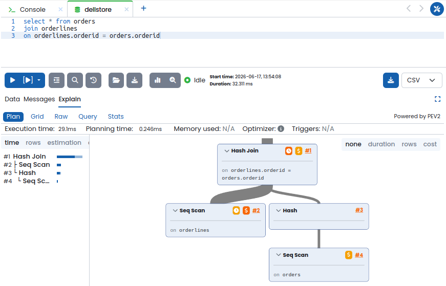


## Viewing and Editing Table Data

Table data can be explored and edited in a visual format using the Data Editor. To open the data editor right-click the table node in the Database Explorer and select `Edit Data` from the context menu.

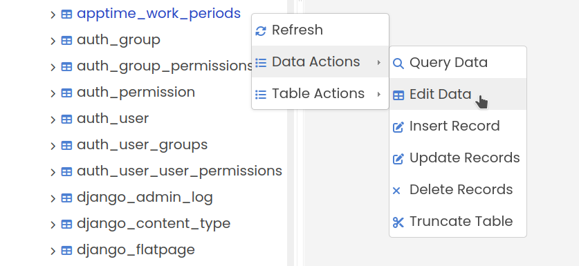  

A new data editor tab will be shown. By default, the first 25 rows of the query will be fetched with no filters applied.  


Rows, columns or cell regions can be selected:  

**Select a cell:** Click on a cell to select it  
**Select a Row:** Click the row number/index cell on the left  
**Select a Column:** Click the column header cell at the top  
**Select a Region:** Click and drag across cells, or hold Shift + Arrow Keys  

Right-click on the selection (or use a context menu key) to reveal the available operations.


### Filtering the data
Additional data filtering can be applied by either adding filtering criteria visually or by toggling plain SQL input and entering the clause manually.
Click the funnel button to apply new filter and limit settings.
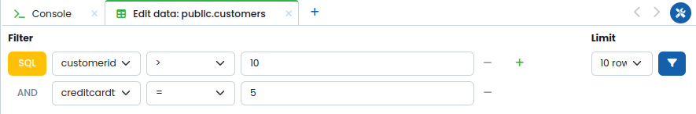  

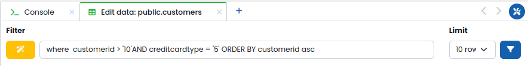

### Making changes
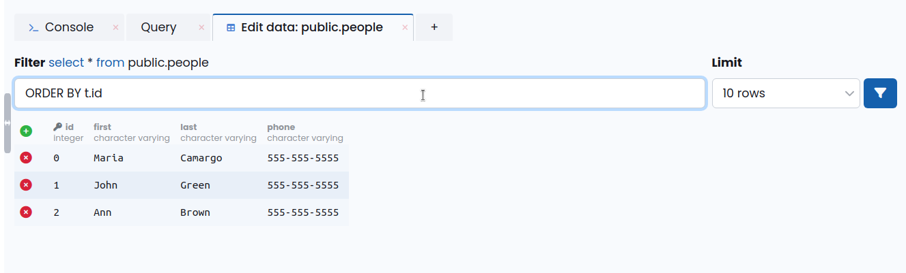

The data editor allows the following changes:
- **Add a row:** Click on the `➕ icon` on the top-left of table header. The new empty row will be added to the top of the grid.
- **Delete a row:** Click on the `❌ icon` next to a row to mark it as a candidate for deletion.
- **Edit cells:** Double-click a specific cell or press the `Enter` to enter inline edit mode, make the changes. Click outside the cell or press `Enter` to exit from edit mode, hit `Esc` key to discard cell changes.  
For cells with large text, JSON, or complex data payloads, right-click the cell and select **Edit in modal** to open a dedicated editor window. 
- **Revert the Changes**: changed table rows are marked in red(deleted) and orange(edited) colors. You can revert any change by clicking the `↺` Revert icon to the left of the row.

Once the desired changes are complete, click the `Apply changes` to save the data.

---

## Creating and Editing Tables
Database tables can be created and edited in Schema Editor.  
To create a new table, right-click the **Tables** node in the Database Explorer and select the `➕ Create Table` menu item.  
To edit an existing table right-click its node in Database Explorer and select `Alter table` menu item.  

The schema editor tab will be shown
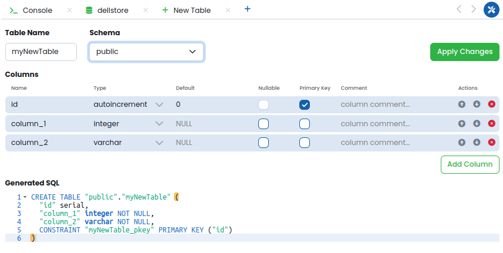

Define table columns, their order and properties.  
The SQL code for operations to be performed will be updated in live mode as you change the table definition.  
Each column item has several action buttons on the right.  
Newly created columns can be reordered by clicking UP and DOWN buttons.  
Columns can also be deleted. Newly defined columns will be removed immediately. Existing columns will be marked for deletion (highlighted in red); deletion can be reverted by clicking the revert button.  

Once ready, click `Apply Changes` to execute the generated SQL code.

ℹ️ UI controls in the Schema Editor automatically adapt based on your database type and the operation type (creating vs. editing a table).  For example, when modifying an existing table, the editor unlocks dedicated tabs to manage table indexes and foreign keys. 

---

## Entity Relationship Diagrams

The Entity Relationship Diagrams (ERD) module allows you to visually represent tables and their relationships.
Right-click on a particular Schema (for Postgres) or a Database node and select `ER Diagram` from the context menu to open the diagram.

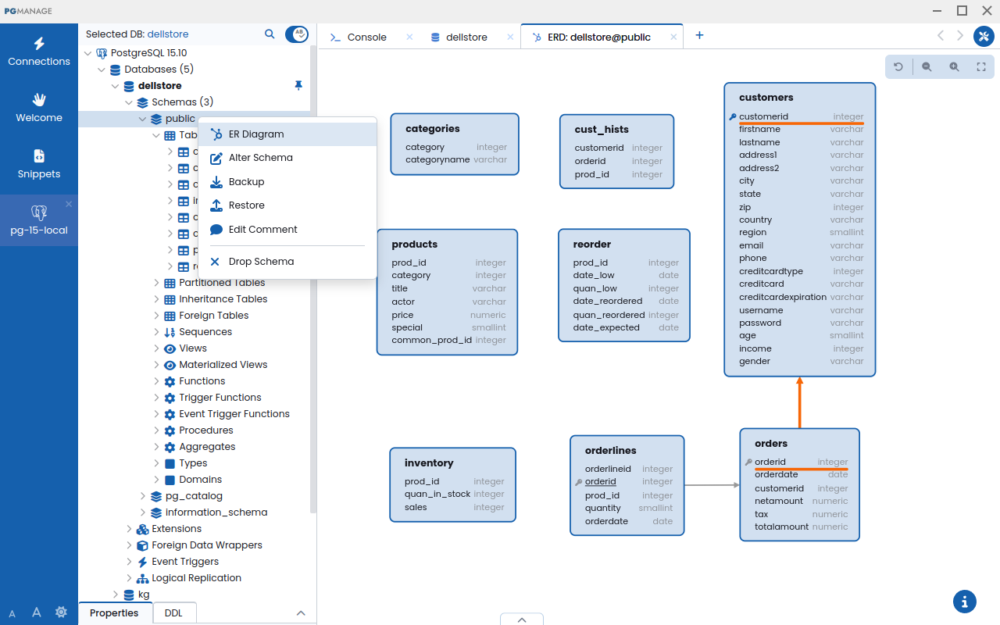

The diagram displays tables and their columns along with their respective data types.  
Foreign keys columns and their references are marked with the key icon.

### Interacting with the Diagram:

**Highlight Relationships:** Click a relationship line (edge) to highlight the link and its connected columns.  
**Rearrange Tables:** Drag diagram nodes manually to rearrange the layout.  
**Navigate the Canvas:** scroll up/down to change the zoom, click on an empty space and drag to pan. You may also use the toolbar on the top-right to zoom reset the layout or toggle fullscreen mode for the diagram.  


### Layout Persistence
The application automatically saves your customizations, including pan, zoom, and table positions. These settings are fully restored when you reopen the database workspace.


---

## SQL Templates

The application automatically creates a template for actions selected in the DB Entity Tree.
For example, vacuum table template can be created by right-clicking the table node in Database Explorer and selecting `Templates → Vacuum table`. For a given table, the following text was generated in a query tab:

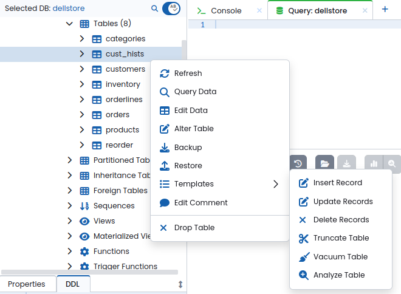


Then the templated code in the query editor can be adjusted as needed and executed.

---

## Snippets

Frequently used SQL commands or other chunks of code can be saved as Snippets.

The snippets panel can be shown by clicking the `Snippets` icon on the sidebar or by maximizing the panel by clicking the little tab at the bottom of the screen.  
To minimize it, either click on any other item on the sidebar or click the little tab on the top of the panel.

The tree on the on the left shows existing snippets and folder. Here you can view and manage your snippets.  
The snippet contents can be viewed and edited in the tabs on the right.

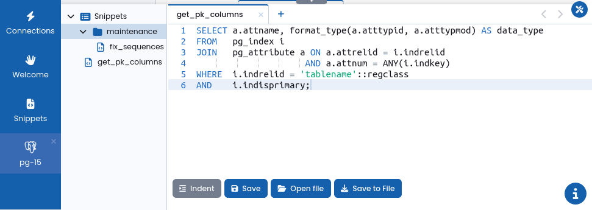

To create a new snippet click on the  `➕` icon in the snippet panel tab list or right-click the root node (or a folder) in the snippets tree and click the `New Snippet` in the context menu. Write the snippet code in the editor and click 'Save'.

To open an existing snippet for editing double-click its node in the tree.

Snippets can be organized in folders. To create a folder right-click a parent node for the folder in the tree and select the `New Folder` option from context menu.  

ℹ️ Snippet contents can be saved to file or loaded from file using the corresponding toolbar buttons. You can also drag and drop a text file to a snippet editor  to import its contents.

Snippets can then be used in the Query Editor by clicking one of the items under the `Use Snippet` context menu section.

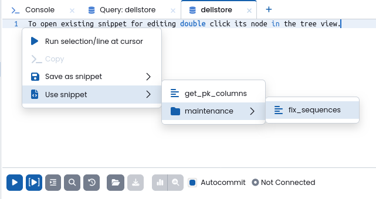

---

## Console tab

The database console behaves similarly to native database console tools like psql etc. and may be used in scenarios where more "direct" database access is desired.

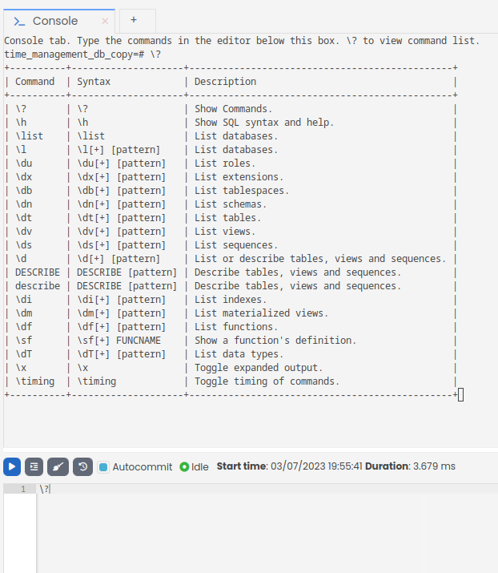

## Monitoring dashboard

The monitoring dashboard displays various database performance metrics in form of graph/chart/grid widgets.  
ℹ️ The monitoring dashboard is available for PostgreSQL, MariaDB, and MySQL only.

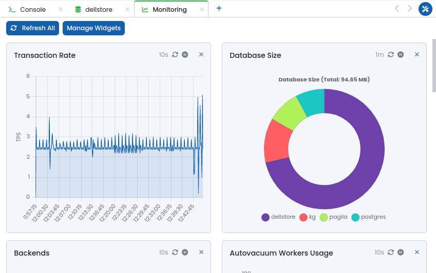  

Displayed widgets can be hidden from the dashboard by clicking the `✖` icon on the corresponding widget.  
Widgets refresh their data periodically. You can set the refresh period for each widget by clicking its current refresh interval and selecting a new option from the dropdown menu.  
Widget auto-refresh can be toggled by clicking the `▶/❚❚` button.

Here is a list of widgets available for PostgreSQL database:

| Widget   | Type  | Description |
| -------- | ----- | ----------- |
| Activity  | Grid | Lists database backends, similar to Backends tab    |
| Autovac Freeze: Top 20 Tables | Grid | Top 20 tables|
| Autovacuum Freeze    | Grid |  Autovacuum freeze percentage |
| Autovacuum Workers Usage | Timeseries | Percentage of busy autovacuum workers on the server |
| Backends | Grid | Number of backends on the server |
| Backends | Chart | Number of backends used per database |
| Bloat: Top 20 Tables | Grid | Lists Top 20 bloated tables for the currently selected database |
| Blocked Locks | Timeseries | Number of blocked locks over time |
| Checkpoints | Timeseries | Number of checkpoints |
| Database Growth Rate | Timeseries | Database growth rate |
| Database Size | Chart | Database sizes for the current server |
| Heap Cache Miss Ratio | Timeseries | Heap Cache Miss Ratio
| In Recovery | Text | Indicates if server is in recovery |
| Index Cache Miss Ratio | Timeseries | Index Cache Miss Ratio
| Long Autovacuum | Timeseries | Long Autovacuum | 
| Long Query | Timeseries | Long Query | 
| Long Transaction | Timeseries | Long Transaction | 
| Seq Scan Ratio | Timeseries | Sequential scan ratio |
| Temp Files Creation Rate | Timeseries | Temp Files Creation Rate |
| WAL Production Rate | Timeseries | WAL Production Rate |
| Transaction Rate | Timeseries | Total number of transactions (commits+rollbacks) over time for the current server |  

Widget visibility, display order and customization can be done in widget management dialog accessible by clicking the `Manage Widgets` button.


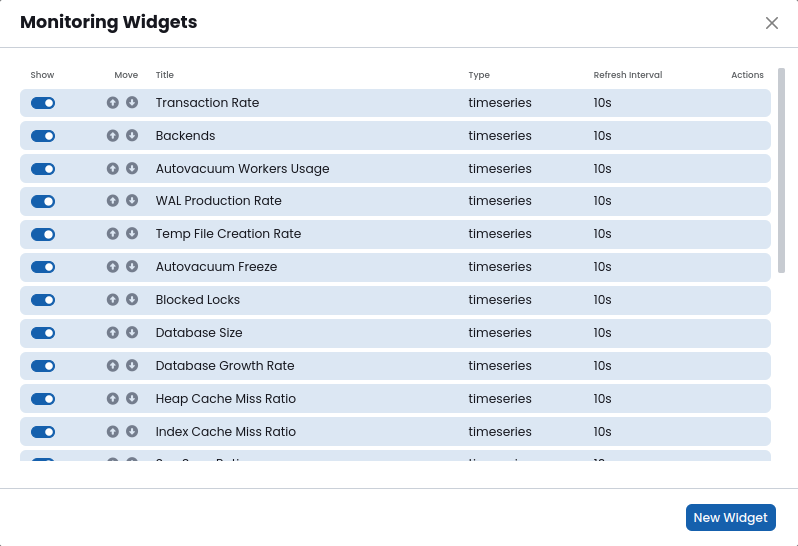  

Custom monitoring widgets may be created by clicking `New Widget` button. This will open a widget editor:
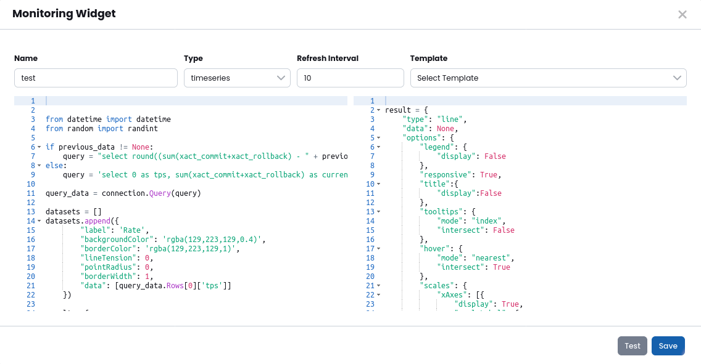

The easiest way to create a new widget is by using an existing one as a template.


## Backends/Process List

The backends tab can be used to view the list of active database sessions and terminate a particular session.  
The list of db sessions is refreshed automatically, you can change the refresh period by clicking its current value.  
You can terminate a database session by clicking the `❌` icon.  

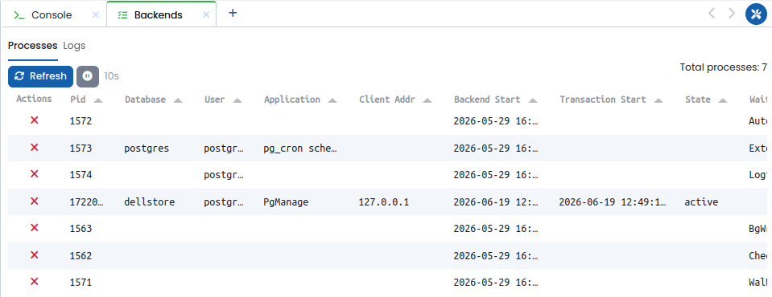  


For Postgres family of databases it is also possible to view and search server logs.
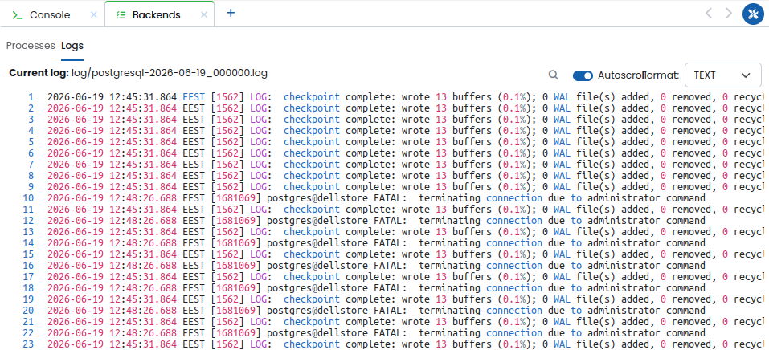  
If no logs can be seen, please ensure that your database server is properly configured. The following parameters must be set:  
- log_destination = stderr (or a combination of stderr, csvlog, jsonlog)  
- logging_collector = on  

These parameters can be configured in the [Server Configuration module](#postgresql-configuration-management)  
Please refere to the [official Postgres documentation](https://www.postgresql.org/docs/current/runtime-config-logging.html) for more details on how to configure logging 

ℹ️ the Backends/Process list tab is available for PostgreSQL, MariaDB, and MySQL only.

---

## Postgres Database Administration


### Role Management

Postgres roles can be created and edited in Role Editor.
To create a new role, right-click the `Roles` node in the Database Explorer and select the `➕ Create Role` menu item.  
To edit an existing role, right-click its Database Explorer node and select the `Alter Role` menu item.  

The role editor will be shown:

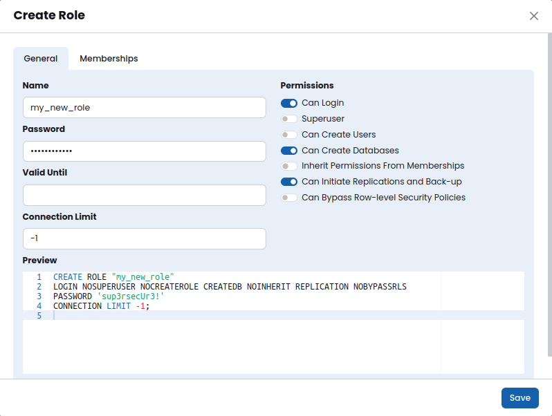  

Here you can define the name of the role, its password, validity date and other attributes.  
The `Memberships` tab allows you to define memberships of this role. Please refer to the official [Postgres Role Membership](https://www.postgresql.org/docs/current/role-membership.html) for details on how role members work.

The SQL code for the role changes will be updated in live mode as you change the role definition.  
Once ready, click the `Save` to execute the generated SQL code.

---

### Server Configuration Management

Audax provides a convenient user interface for PostgreSQL's `ALTER SYSTEM` set of commands via the Server Configuration module.  
The Server Configuration module can be used to change Postgres server parameters without having to manually edit the **postgresql.conf** file or running `ALTER SYSTEM` queries.  
In addition to that, this module allows you to keep track of your changes and restoring older configuations from previously saved snapshots.

To open the Server Configuration module, right-click on the server node in the Database Explorer and select `Server Configuration`.

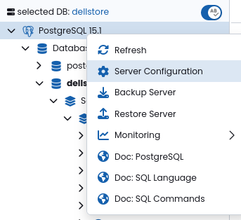

A new tab will open with the server configuration settings. Here you can search for a particular setting, filter available settings by category, the list of matching settings will be automatically displayed. Each list item shows the setting name along with a brief description.  
Setting value can be changed by entering new value in the corresponding input field. Previously altered settings can be reverted to defaults by clicking the revert icon of the corresponding setting.  
Once the necessary set of configuration changes is made the changes must be applied by clicking the `Apply` button. A prompt with the list of pending configuration changes will be shown. Here, you can provide a name for the current configuration snapshot.  
Once committed, the server configuration changes will be applied and the snapshot of the previous configuration should appear in the `Config History` drop-down menu.  
The previous configuration snapshots can be restored by selecting the snapshot from the dropdown menu and clicking the revert button.

ℹ️ The app will notify show if there are configuration changes require a PostgreSQL server restart that should be done manually.

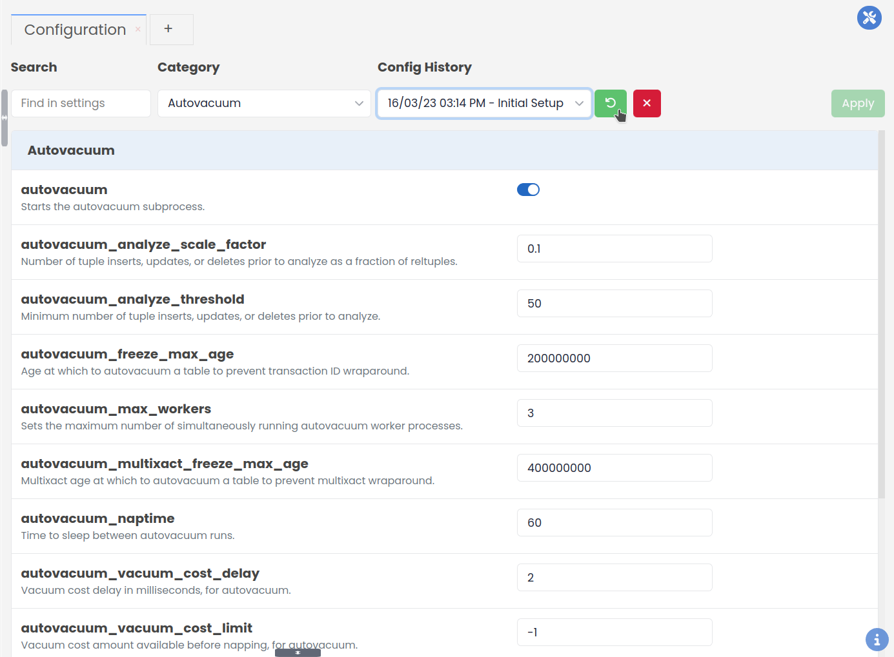

---

### Database Extension Management

PostgreSQL Extensions can be managed via the dedicated dialog accessible by right-clicking the `Extensions` node and its subnodes in the DB Object Tree.

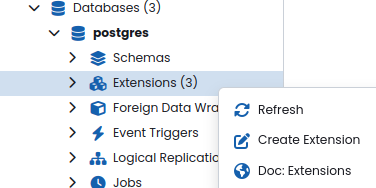  

Click `Create Extension` to open the extension management dialog. Here you can select the extension to be installed, the schema where to install the extension and the extension version. Optionally, you can set the extension comment. A preview of the `CREATE EXTENSION` query will be displayed under the Preview section. Click `Save` button to apply the changes.

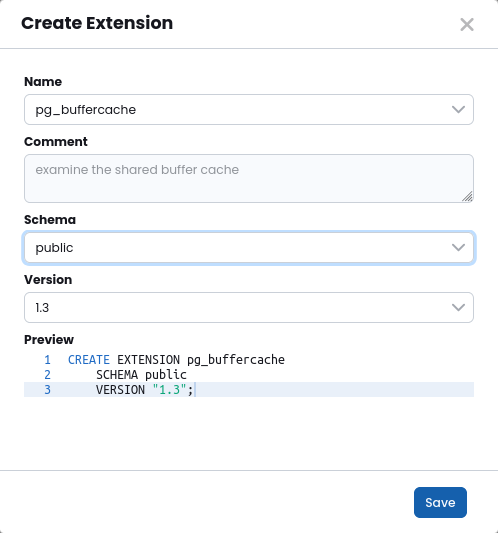

Right-clicking on a given extension will display a menu with the following options:

- **Alter Extension:** opens the edit dialog for the selected extension. Here you can alter the properties of the existing extension.

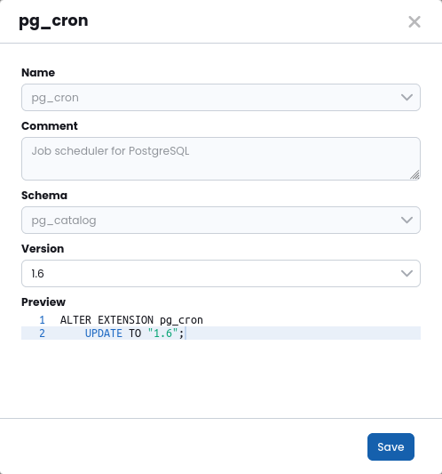

- **Edit Comment:** opens a new tab with a `COMMENT ON EXTENSION` query.
- **Drop Extension:** opens an extenstion drop modal.

---

### Database Backup and Restore

Audax has a convenient user interface for Postgres [pg_dump](https://www.postgresql.org/docs/current/app-pgdump.html), [pg_dumpall](https://www.postgresql.org/docs/current/app-pg-dumpall.html), and [pg_restore](https://www.postgresql.org/docs/current/app-pgrestore.html) set of commands.  

These features can be accessed by selecting the **Backup** or **Restore** options from the context menu of a Server, Schema, or Table node in the Database Explorer.  

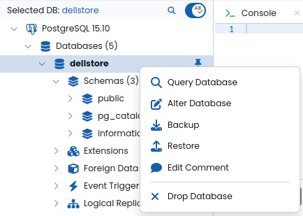

Backup and restore operations in background, allowing you to perform other tasks in the app without interrupting the process. You will be notified once the job completes.

On both the Backup and Restore tabs the **Jobs** section lists previous and currently running operations. Each entry displays job information such as PID, Type, Server, Object, Start Time, Status, Duration, and Actions.  
Under the **Actions** column, you can view the details of a specific job, terminate it, or delete it from the history. Clicking the `View Details` icon reveals extra information about the job, including the command being executed and its output.

#### Backup

To create a backup, right-click on the server, database or a table node of the Database Explorer. Then, select `Backup Server` or `Backup` context menu option respectively. This will open the following tab:

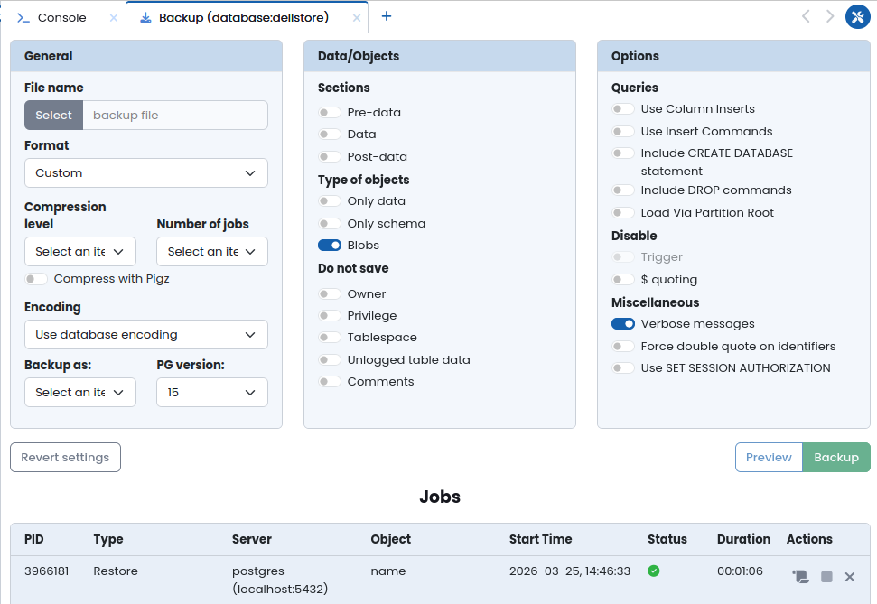

Click the `Select` button near the a File Name form field to set the destination file/path for your backup.  
Set the format for your backup: **custom**, **.tar** **plain**, or **directory** formats are supported for database backups. The whole server can only be backed up in **plain** format.  

Set other backup parameters:  
The **Compression level** sets how aggressively your backup is compressed. 0 means no compression, resulting in faster backups but larger files. 9 provides maximum compression for the smallest file size, but takes the most time and CPU power.
This option has no effect on plain or tar backup format.

The **Number of jobs** sets how many backup processes will be run in parallel for your backup job. A higher number produces backups faster but puts more load on your database server. This parameter has a different meaning depending on PIGZ compression toggle. If PIGZ compression is enabled, this option defines how many pigz compressor processes to run to compress the backup. Otherwise this parameter defines the number of parallel pg_dump processes; in such cases this option is only available when the Directory backup format is used.

The **Encoding** parameter specifies the character set to use when creating a backup. If left unspecified, the database's default backend encoding is used.

The **Backup as** parameter allows you to set the role to use when creating a backup.

The **PG Version** parameter allows you to set the preferred version of pg_dump to use. By default, Audax will try to use the version matching the database server you are connected to. Otherwise, the highest available version will be used.  
💡 If the exact Postgres client binaries version is not available, using the highest available version is generally safe, as newer pg_dump binaries can back up older PostgreSQL databases.

The **Compress with Pigz** switch allows you to use a more performant database compression method that can take advantage of multiple CPUs available on the machine you run Audax on. Please refer to the [Pigz Support](#pigz-support) section for configuration details.

Once the general information is filled out the `Revert settings`, `Preview`, and `Backup` buttons will be made available.
- **Revert settings:** resets the backup dialog settings to their default.
- **Preview:** displays a modal with the command to be executed.
- **Backup:** executes the backup commands as indicated in the form.

#### Restore

To restore a server or a specific database, right-click the corresponding item in the Database Explorer and select `Restore Server` or `Restore` from the context menu. A new tab will open displaying the Restore dialog.

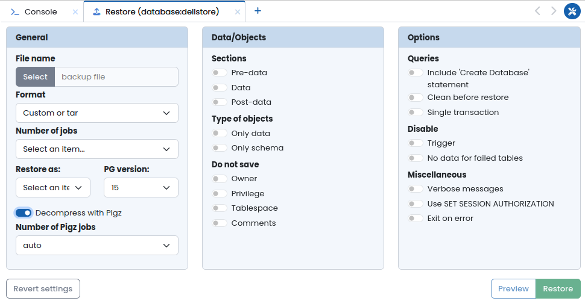

Click the `Select` button near the a File Name form field to choose the database backup to restore.  
The format field will be set based on backup file extension, alternatively you can set the format manually.  

Set other restore parameters:  

The **Restore as** parameter allows you to set the role to use when restoring the backup.

The **PG Version** parameter allows you to set the preferred version of pg_dump to use. By default, Audax will try to use the version matching the database server you are connected to. Otherwise, the highest available version will be used.  
💡 If the exact Postgres client binaries version is not available, using the highest available version is generally safe, as newer pg_dump binaries can back up older PostgreSQL databases.

The **Decompress with Pigz** switch allows you to use a more performant database decompression method that can take advantage of multiple CPUs available on the machine you run Audax on. Please refer to the [Pigz Support](#pigz-support) section for configuration details.

The **Number of Pigz jobs** option becomes available if Pigz decompression is enabled. This parameter allows you to set how many Pigz processes to run to decompress the backup. More jobs will decompress faster but will also result in more CPU usage on the machine running Audax.

Once the general information is filled out the `Revert Settings`, `Preview`, and `Backup` buttons will be made available.
- **Revert settings:** resets the restore dialog settings to their default.
- **Preview:** displays a modal with the command to be executed.
- **Restore:** executes the restore commands as indicated in the form.


#### Pigz Support
A more performant Pigz backup compressor is supported on Linux. If desired, PIGZ needs to be installed on the target OS. For example, in Ubuntu, you may install it as follows:

```
sudo apt update -y
sudo apt install -y pigz
```
Set Pigz binary path in `Utilities Menu → Settings → Paths`.


Once installed, toggle the `Compress with Pigz` or `Decompress with Pigz` switch on the backup/restore screens respectively.

---
## pg_cron GUI Instructions

First, install pg_cron extension in your target OS. For example, in Ubuntu, you may install it as follows:

```
sudo apt-get -y install postgresql-[postgres version]-cron
```

Next, add pg_cron to `shared_preload_libraries` in the server configuration management module:

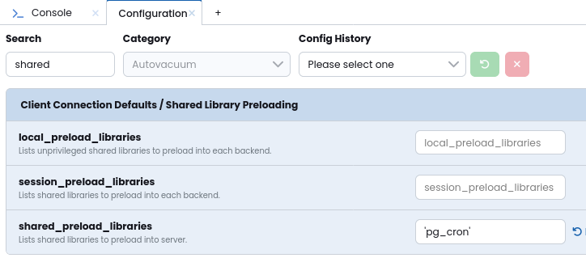

Reload postgres configuration to apply the changes:

```
sudo pg_ctlcluster [version] [cluster_name] reload
```
Then, the pg_cron functions and metadata tables can be created.

Add **pg_cron** extension via Extension Manager:  \
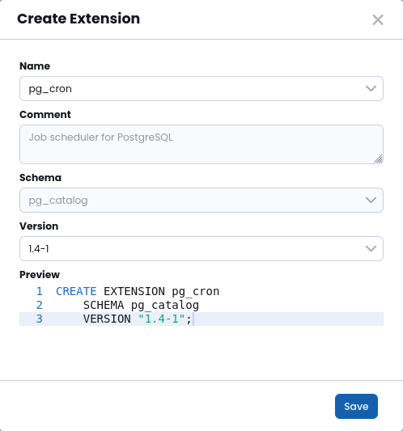

Now the new `Jobs` item should be available under the database node  

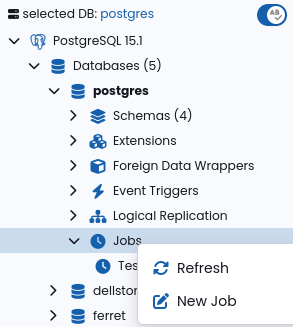

A new job can be created by right-clicking the `Jobs` node, existing jobs can be edited by selecting the `View/Edit` option from the job context menu.
In the Job dialog the following options are available:
- **Job Name**
- **Run In Database**: the database against which to run the query
- **Run At/Cron expression**: the period for running the job. You can use the Cron schedule widget to define the schedule or click the `Define manually` switch and write Cron expression by hand.
- **Command to Run**: the SQL expression to be executed at the specified schedule

When viewing the existing job, the `Job Statistics` tab can be used to view last 50 job execution results.

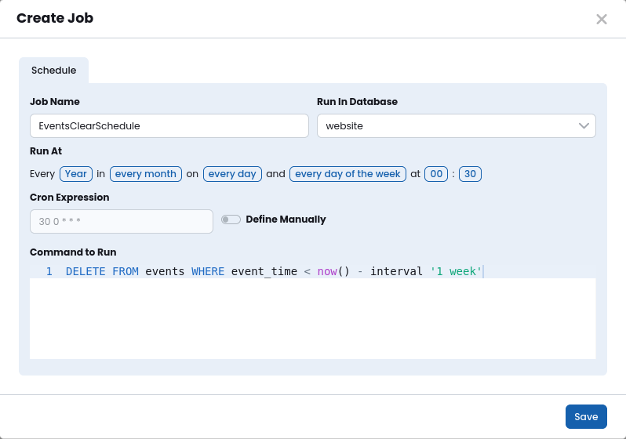

**Important:** By default, pg_cron uses libpq to open a new connection to the local database, which needs to be allowed by pg_hba.conf. It may be necessary to enable trust authentication for connections coming from localhost for the user running the cron job, or you can add the password to a .pgpass file, which libpq will use when opening a connection. \
Please refer to [official pg_cron documentation](https://github.com/citusdata/pg_cron#ensuring-pg_cron-can-start-jobs) for more details.
