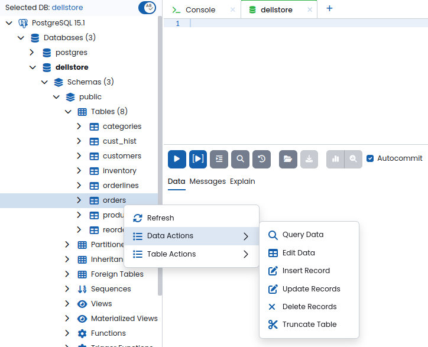
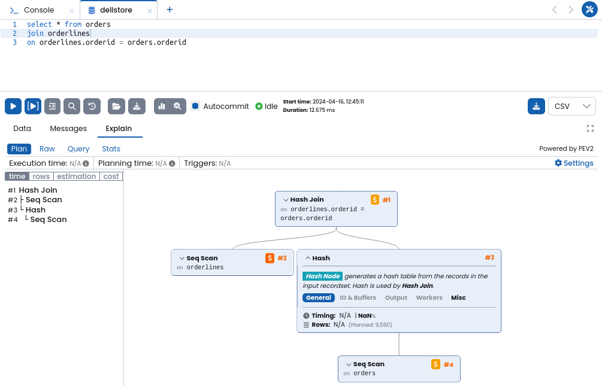
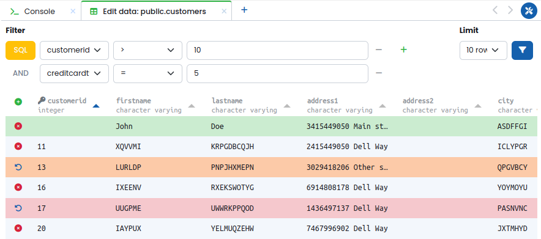
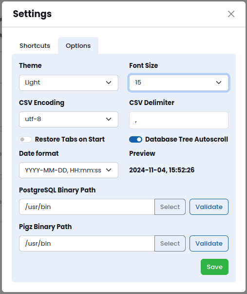

# User Guide


---

## Database Entity Tree and Context Menus

The DB entity tree displays the database objects inside a server and is located at the right of the primary menu once a database session is established.


Most of the DB tree nodes have a context menu with a list of actions available for the node. The context menu can be accessed by right-clicking on the tree node.




## Tabs for Different Operations

The area to the right of the DB entity tree contains the operation tabs. There are many tab types, the most common are:
  - Query - this tab is used to edit and execute queries against the database
  - Database Console - shows a command-line-like interface for the database
  - Monitoring dashboard - displays various database performance metrics for the database.
  - Backends - displays a list of active database back-ends, allows to terminate a particular back-end.

 The tabs listed above can be opened by clicking on the `➕` sign on the tabs panel.

### Query tab

The Query Tab is used to write and execute SQL queries. The top area of the tab contains the SQL editor. The toolbar in the middle allows to run most frequently used actions such as running the query, formatting query code, import/export SQL from files etc. The bottom part of the screen contains the query result data-grid and query plan visualizer.


#### Editing the code
The query editor suports syntax highlighting code completion and formatting for most common SQL dialects.  

The code completion operates in live mode by default. Live completion may be disabled for the current database connection by toggling the `Ab` switch on top of the database object tree. The autocomplete can also be called with a hotkey (`Ctrl-Space`  or `Cmd-Space` by default).

The code can be auto-formatted either clicking the the `Format SQL` button or with a hotkey (`Alt-S` by default)


#### Running the query
The query can be executed by clicking the `Run` button on the toolbar.
The `Run Selection` button allows to execute the selected part of the code in the query editor, if no code is selected the code line under the cursor will be executed. Alternatively, the selected region of the code can be executed via context menu of the editor.

Once query is executed its output will be displayed in the query results data-grid. Query results with more than 50 rows, are loaded in chunks, click `Fetch More` or `Fetch All` respectively to load the next chunk or complete query result.

#### Working with query results
The contents query results data grid can be copied to clipboard. First, select the rows to be copied by clicking on them, then right-click on the data grid and select the `Copy` option of the context menu.  
The contents of data-grid cells can be viewed in a pop-up window, this is especially useful with cells containing large amounts of data. To view the contents of the cell either double-click on it or select the `View Content` option of its context menu.  
The query result data can be exported into a file by selecting the desired export format in the drop-down (XLSX or CSV) and clicking the `Export Data` button.

#### Running previous queries
PgManage keeps the history of previously executed queries. The history records can be searched and filtered by date range and the database.  
Click the `Query History` button to bring up the history modal. Right-click on the query column of the history record and select the `Copy Content to Query Tab` context menu option.


#### Visualizing the query execution plan
The query execution plan visualizer can be called by switching to the explain link of the query tab. To run `EXPLAIN ANALYZE` click on the corresponding button on the toolbar. Alternatively the query can be prepended by `EXPLAIN` or `EXPLAIN ANALYZE` keywords and executed. 
  


> **Note:** The Explain functionality is available for PostgreSQL only.


### Console tab

The database console behaves similar to native database tools like psql etc. and may be used in scenarios where more "direct" database access is desired.


### Monitoring dashboard

The monitoring dashboard displays various database performance metrics in form of graph/chart/grid widgets:

- Activity
- Autovac Freeze: Top 20 Tables
- Autovacuum Freeze
- Autovacuum Workers Usage
- Backends
- Bloat: Top 20 Tables
- Blocked Locks
- Checkpoints
- Database Growth Rate
- Database Size
- Heap Cache Miss Ratio
- In Recovery
- Index Cache Miss Ratio
- Long Autovacuum
- Long Query
- Long Transaction
- Seq Scan Ratio
- Temp Files Creation Rate
- WAL Production Rate
- Transaction Rate

The list of displayed monitoring widgets can be configured by clicking on `Manage Widgets` and selecting the desired graphs. Alternatively, one can remove graph widgets from the dashboard by clicking the `❌` icon of the corresponding widget.  
The refresh interval of each widget can be configured by entering the number of seconds in the corresponding input field of the widget and hitting the enter key.  
Custom monitoring widgets may be created by `Manage Widget → New Widget`. This will open a modal window where name, type, refresh interval and template can be specified. Once a template has been selected, you may edit the data source script and graph parameters.


>**Note:** the monitoring dashboard is available for PostgreSQL, MariaDB, and MySQL only.


### Backends/Process List

The `backends` tab displays the list of active database session processes with information such as process id, start time, query, transaction start time, connected user, etc. One can terminate a running back-end process by clicking the `❌` icon.  
>**Note:** the Backends/Process list tab is available for PostgreSQL, MariaDB, and MySQL only.

---

## Editing Table Data

Table data can be edited in visual format using the Data Editor module. This feature can be accessed by right-clicking on a table node in the DB entity tree.


A new data editor tab will be shown. By default, the first 10 rows of the query will be fetched. A text field allows to change the query's conditions. Click on the funnel button to apply new filter and limit settings.



The data editor allows the following changes:
- **Add a row:** Click on the `➕ icon` on the top-left of table header. The new empty row will be added to the top of the grid.
- **Delete a row:** Click on the `❌ icon` next to a row will mark it as a candidate for deletion.
- **Edit cells:** Double-click on a data cell to enter the edit mode, make the changes, click outside the cell to exit from edit mode, hit `Esc` key to discard cell changes.
- **Revert Changes**: changed table rows are marked with red and orange colors for deleted and edited rows respectively. You can revert row changes by clicking the revert button to the left of the row.

Once the desired changes are done, click on the `Apply changes` button.

---

## Working With Snippets

The snippets panel can be shown by clicking the snippet icon on the sidebar. To minimze it either click on any other item on the sidebar or click the litte gray tab on the top of snippets panel.

The snippets interface has a tree-view which display and allows for managing snippets left and a tabbed editors on the right.


To create a new snippet click on the  `➕` icon in the snipped panel tab list or right-click the root node in the tree-view and click the  `New Snippet` item from the context menu. Write the snipped code in the editor and click the 'Save' button.

To open existing snippet for editing double click its node in the tree view.

Snippets can be ordganized in folders. To create a folder right-click a parent node for the folder in the tree view and click the `New Folder` context menu item.

To use a saved snippet, open a query tab and right-click on the query editor. Here you may use, overwrite, or create a snippet.
The snippets can then be used in the query editor by clicking on of the items under the `Use Snippet` context menu section.


---

## PostgreSQL Configuration Management

PgManage provides a convenient user interface for PostgreSQL’s `ALTER SYSTEM` set of commands via the `Server Configuration` module. This command is used to change the server’s parameters without having to manually alter the `postgresql.conf` file or running `ALTER SYSTEM` commands.

To open the Server Configuration module, right-click on the server node in the DB entity tree and select `Server Configuration`.


A new tab will open with the server configuration settings. Here you can search for a particular setting, filter available settings by category, the list of matching settings will be automatically displayed. Each list item shows the setting name along with a brief description. Setting value can be changed by entering new value in the corresponding input field. Settings which have non-default values can be reverted to defaults by clicking revert icon of the corresponding setting.  
Once the necessary set of configuration changes is made the changes must be applied by clicking the `Apply` button. A prompt with the list of configuration changes to be made will be shown. Here, you can provide a name for the current configuration snapshot.  
Once committed, the server configuration changes will be applied and the snapshot of the previous configuration should appear in the `Config History` drop-down menu.  
One may return to a previous configuration snapshot by selecting the snapshot from the dropdown menu, clicking the revert button, and confirming the operation.

>**Note:** PgManage will notify the user if any configuration changes require a PostgreSQL server restart that should be done manually.


---

## PostgreSQL Extension Management

PostgreSQL Extensions can be managed via the dedicated dialog accessible by right-clicking the `Extensions` node and its subnodes in the DB Object Tree.

When the `Extensions` node is right-clicked, the following menu will be displayed:


Clicking `Create Extension UI` option will open the extension management dialog. Here you can select the extension to be installed, the schema where to install the extension and the extension version. Optionally, you can set the extension comment. A preview of the `CREATE EXTENSION` query will be displayed under the Preview section. Click `Save` button to apply the changes.


Right-clicking on a given extension will display a menu with the following options:

- **Alter Extension UI:** The `Alter Extension UI` option will open management dialog for the selected extension. Here you can alter the properties of the existing extension.


- **Alter Extension:** Displays a template on a new tab with an `ALTER EXTENSION` query.

- **Edit Comment:** Displays a template on a new tab with a `COMMENT ON EXTENSION` query.

- **Drop Extension UI:** The `Drop Extension UI` will open a prompt confirming if the given extension should be dropped. Cascading can be enabled if desired.


- **Drop Extension:** Displays a template on a new tab with a `DROP EXTENSION` query.


---

## SQL Templates

The application automatically creates a template for actions selected in the DB Entity Tree.
For example, a new record can be created by right-clicking on a table object and selecting `Data Actions → Insert record`. For a given table, the following text was generated in a query tab:


Once the desired information has been filled out, the query may be executed with the `run` button and a `INSERT 0 1` message will be displayed at the `Data` tab.


> **Note:** In future releases, this feature is planned to be re-implemented in an user interface.

---

## Backup and Restore

The **Backup** and **Restore** features provide a convenient user interface for Postgres' [pg_dump](https://www.postgresql.org/docs/current/app-pgdump.html), [pg_dumpall](https://www.postgresql.org/docs/current/app-pg-dumpall.html), and [pg_restore](https://www.postgresql.org/docs/current/app-pgrestore.html) set of commands.

The backup and restore operations run as background jobs, allowing you to navigate outside of the backup/restore tab without interrupting the process. Once the job completes the notification will be shown.

The backup/restore jobs are listed under the `Jobs` section. Here, information such as PID, Type, Server, Object, Start Time, Status, Duration, and Actions will be displayed.

Under the `Actions` column, you may view details about a specific job or delete the job. The information about the job will contain the executed command, the start time, the duration of execution, and the output. The output of currently executing jobs can be viewed live by clicking its View Details icon.


### PIGZ Support
A more performant PIGZ backup compressor is supported on Linux. If desired, PIGZ needs to be installed on the target OS. For example, in Ubuntu, you may install it as follows:

```
sudo apt update -y
sudo apt install -y pigz
```
Next, the path to the PIGZ binaries needs to be specified in `Utilities Menu → Settings → Options → Pigz Binary Path`.



Once installed, toggle Compress with Pigz or Decompress with Pigz switch on the backup/restore screens respectively.

### Backup

PgManage allows you to create backups for a database or the whole server. Database backups can be made in`custom`, `.tar`, `plain`, or `directory` formats. The only format supported for server backups is `plain`.

To create a backup, right-click on the server object or a database object on the DB entity tree. Then, select `Backup Server` or `Backup` respectively. This will open the following tab:


Once the general information is filled out the `Revert settings`, `Preview`, and `Backup` buttons will be made available.
- **Revert settings:** resets the backup dialog settings to their default.
- **Preview:** displays a modal with the command to be executed.
- **Backup:** executes the backup commands as indicated in the form.

### Restore

To restore the server or a database, right-click on the appropriate object on the DB entity tree and select `Restore Server` or `Restore` respectively. A new tab will open with the restore dialog.


Once the general information is filled out the `Revert Settings`, `Preview`, and `Backup` buttons will be made available.
- **Revert settings:** resets the restore dialog settings to their default.
- **Preview:** displays a modal with the command to be executed.
- **Restore:** executes the restore commands as indicated in the form.

---
## pg_cron GUI Instructions

First, install pg_cron extension in your target OS. For example, in Ubuntu, you may install it as follows:

```
sudo apt-get -y install postgresql-[postgres version]-cron
```

Next, add pg_cron to `shared_preload_libraries` in server configuratiom management moule:


Reload postgres configuration to apply the changes:

```
sudo pg_ctlcluster [version] [cluster_name] reload
```
Then, the pg_cron functions and metadata tables can be created.

Add *pg_cron* extension via Extension Manager:  \


Now the new `Jobs` item should be available under the database node:


A new job can be created by right clicking the `Jobs` node, existing jobs can be edited by selecting the ``View/Edit`` option from the job context menu.
In the Job dialog the following options are available:
- **Job Name**
- **Run In Database**: the database against which run the query
- **Run At/Cron expression**: the period for running the job. You can use the Cron schedule widget to define the schedule or click the ``Define manually`` switch and write Cron expression by hand.
- **Command to Run**: the SQL expression to be executed at the specified schedule

When viewing the existing job, the ``Job Statistics`` tab can be used to view last 50 job execution results.


**Important:** By default, pg_cron uses libpq to open a new connection to the local database, which needs to be allowed by pg_hba.conf. It may be necessary to enable trust authentication for connections coming from localhost in for the user running the cron job, or you can add the password to a .pgpass file, which libpq will use when opening a connection. \
Please refer to [official pg_cron documentation](https://github.com/citusdata/pg_cron#ensuring-pg_cron-can-start-jobs) for more details.
