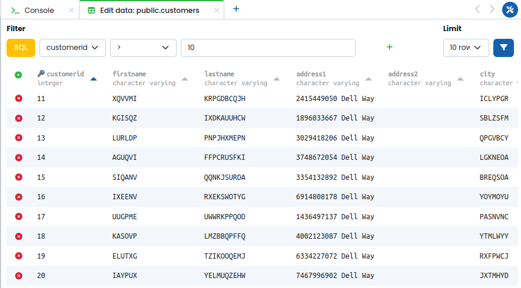
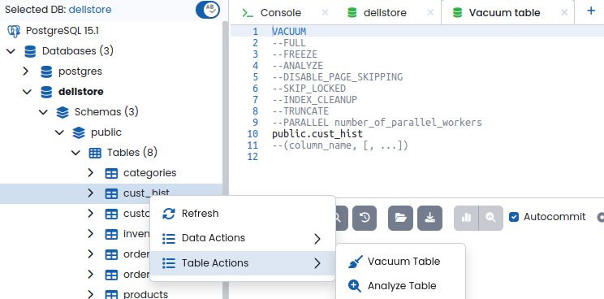

# User Guide


---

## DB Entity Tree and Context Menus

The DB entity tree displays all of the database objects inside a server and is located at the right of the primary menu once a database session is established.


The **context menus** can be accessed by right-clicking on one of the tree nodes. The context menus allow making actions to the database.


The actions available depend on the selected database object. Here is a list of command actions on alphabetical order:

- **Alter/edit:** opens a new tab with an interface to alter the given object. For example, a table may be altered by right-clicking on the table object and selecting `Table Actions → Alter Table`. From there, you may do the following:
    - Change a field by double-clicking
    - Add a column with the `Add Column` button
    - Remove a column with the `❌ icon` at the end of each row
    - Check the generated query under the `Generated SQL`
    - Execute the generated query with the `Apply Changes` button.


- **Analyze Table:** opens a query tab with a template for the [ANALYZE](https://www.postgresql.org/docs/current/sql-analyze.html) action.
- **Create:** opens a new tab with an interface to create the given object. For example, a table may be created by right-clicking on the `Tables` object and selecting `Create Table`. From here you may do the following:
    - change the table name
    - change the assigned schema
    - edit the columns by double-clicking on the fields
    - add a column with the `Add Column` button
    - remove a column with the `❌ icon` at the end of each line.
    - move a given column up or down with the arrows at the end of each line
    - check the generated query under the `Generated SQL` field.
    - execute the generated query with the `Apply Changes` button.


- **Drop/Delete:** deletes the selected object from the server.
- **Monitoring:** the dashboard or the backends may be selected to be opened on a new tab.
- **Refresh:** refreshes the selected object.
- **Reindex:** opens a query tab with a template for the [REINDEX](https://www.postgresql.org/docs/current/sql-reindex.html) action.
- **Render Graph:** opens a tab with an Entity Relationship diagram. This feature is available by right-clicking one of the schema objects and selecting `ER Diagram`. From there, you may:
    - move the tables by clicking and dragging
    - click on the name of a foreign key to highlight the table's relation with another.


- **Server Configuration:** opens the Server Configuration settings tab.
- **Truncate Table:** opens a query tab with a template for the [TRUNCATE](https://www.postgresql.org/docs/current/sql-truncate.html) action.
- **Update Records:** opens a query tab with a template for the [UPDATE](https://www.postgresql.org/docs/current/sql-update.html) action.
- **Vacuum Table:** opens a query tab with a template for the [VACUUM](https://www.postgresql.org/docs/current/sql-vacuum.html) action.

---

## Tabs for Different Operations

At the right of the DB entity tree, the operation tabs are used to edit and execute the actions selected on the entity tree. A new tab can be opened by clicking on the plus sign on the tabs panel. There are four kinds of tabs:

### Query tab

SQL queries can be written and executed to the database. Below the query editor, there are four buttons: Run, Indent SQL, Command History, Explain, and Explain Analyze. The `Run` button executes the query and displays the query results below the query editor. The `Indent SQL` feature rewrites the query with standard indentation. The `Command History` opens a menu where one can view and search executed queries. The `Explain/Explain Analyze` buttons provide information about the execution and planning time of the query, as well as information about the cost and filtering of rows. The information in the Explain features will be displayed in a graph or tabular form.


> **Note:** The Explain functionality is available for PostgreSQL only.

### Console tab

Though the application allows to work with the database objects through the entity tree, a console may also be used to write commands directly.


### Monitoring dashboard

The monitoring tabs display various database performance metric graphs:

- Activity
- Autovac Freeze: Top 20 Tables
- Autovacuum Freeze
- Autovacuum Workers Usage
- Backends
- Bloat: Top 20 Tables
- Blocked Locks
- Checkpoints
- Database Growth Rate
- Database Size
- Heap Cache Miss Ratio
- In Recovery
- Index Cache Miss Ratio
- Long Autovacuum
- Long Query
- Long Transaction
- Seq Scan Ratio
- Temp Files Creation Rate
- WAL Production Rate
- Transaction Rate

The number of graphs displayed can be controlled by clicking on `Manage units` and selecting the desired graphs. Alternatively, one can remove graph widgets from the dashboard by clicking the `❌ icon` on the top-right of the widget. Personalized monitor units may be created by `Manage units → new unit`. This will open a new tab where the name, type, refresh interval, and template can be specified. Once a template has been selected, you may edit the script on the text editor beneath it.

>**Note:** the monitoring is available for PostgreSQL, MariaDB, and MySQL only.


### Backends

The `backends` tab displays PostgreSQL database session information such as back-end process id, start time, query, transaction start time, connected user, etc. One can terminate a running back-end process by clicking the `❌ icon`.

---

## Snippets

The snippets panel can be accessed by clicking on the snippet symbol on the right side menu. You may write code on the text editor and save it. The indentation feature will automatically rewrite the SQL in a pattern.


To use a saved snippet, open a query tab and right-click on the query editor. Here you may use, overwrite, or create a snippet.


---

## Command History

The command history is available in the query and console tabs. It displays a list of previously executed queries/commands in a given time range. To copy a query from the history, right-click and select `Copy Content To Query Tab`.


---

## Explain

The **Explain** and **Explain Analyze** features provide a visualization of the PostgreSQL execution plan for a query. The Explain feature provides the visualization with cost information while the Explain Analyze feature provides extra information – such as time, number of rows filtered, and buffers.

You may access the graph metrics by clicking on `Settings` at the top right. This allows to display information about cost, time, and rows. Next, you may click on a graph node to display more information about it. Finally, zoom in and out of the graph with the scroll wheel.


---

## Code Autocompletion

To aid with typing speed, the application will suggest the names of available database objects and SQL keywords as you type. Once the autocomplete menu is shown, the suggested option can be selected via the up/down arrow keys and then inserted by pressing Tab. Autocomplete feature may be turned on or off by clicking on the switch at the top of DB Object tree.


---

## PostgreSQL Configuration Management

PgManage provides a convenient user interface for PostgreSQL’s `ALTER SYSTEM` set of commands via the `Server Configuration` context menu item. This command is used to change the server’s parameters without having to manually alter the `postgresql.conf` file.

To access the server configuration for a PostgreSQL connection, right-click on the server object in the DB entity tree and select `Server Configuration`.


A new tab will open with the server configuration settings. You may search for a particular setting, filter available settings by category, apply config changes, or revert to a previously saved configuration snapshot via the `Config History` drop-down menu.

After making the desired changes, click `Apply` to save the configuration. A prompt with the list of configuration changes to be made will be shown. Here, you can provide a name for the current configuration snapshot. Once committed, the server configuration changes will be applied and the snapshot of the previous configuration should appear in the `Config History` drop-down menu.

One may return to a previous configuration snapshot by selecting the snapshot from the dropdown menu, clicking the revert button, and confirming the operation.

>**Note:** PgManage will notify the user if any configuration changes require a PostgreSQL server restart that should be done manually.


---

## PostgreSQL Extension Management

PostgreSQL Extensions can be managed via the dedicated dialog accessible by right-clicking the `Extensions` node and its subnodes in the DB Object Tree.

When the `Extensions` node is right-clicked, the following menu will be displayed:


By clicking `Create Extension UI` a menu will open with a user interface, allowing to enter the extension name, a comment, a schema, and a version. A preview of the created query will be displayed under "Preview":


Right-clicking on a given extension will display a menu with the following options:

- **Alter Extension UI:** The `Alter Extension UI` option will open a user interface to create an `ALTER EXTENSION` query. This displays the following fields: the name of the extension, a comment, the schema, the version, and the query's preview.


- **Alter Extension:** Displays a template on a new tap with an `ALTER EXTENSION` query.

- **Edit Comment:** Displays a template on a new tap with a `COMMENT ON EXTENSION` query.

- **Drop Extension UI:** The `Drop Extension UI` will open a prompt confirming if the given extension should be dropped. Cascading can be enabled if desired.


- **Drop Extension:** Displays a template on a new tap with a `DROP EXTENSION` query.

---

## Data Editor Grid

The data editor grid allows editing data of a specified query in a visual format. This feature can be accessed by right-clicking on a table in the DB entity tree.



Then, a new tab will be created with the data editor. By default, the first 10 rows of the `SELECT * from [table] ORDER BY t.id` query will be displayed. A text field allows to change the query's conditions.


The data editor grid allows the following changes:
- **Delete a row:** Click on the `❌ icon` next to a row and it will become red. You may deselect the row with the going back icon next to the row.
- **Edit cells:** Double-click on a data cell to edit the grid.
- **Displayed rows:** Click on the `Limit` dropdown menu and select the number of desired rows.

Once the desired changes are done, click on the `Apply changes` button.

---

## Exporting Query Data

Once a query has been entered, the resulting data can be exported into `.CSV` and `.XLSX` files. To export data, select the format at the button right of the query tab and click the download button.


Finally, save the file under the data tab.


---

## SQL Templates

The application automatically creates a template for actions selected in the DB Entity Tree.
For example, a new record can be created by right-clicking on a table object and selecting `Data Actions → Insert record`. For a given table, the following text was generated in a query tab:



Once the desired information has been filled out, the query may be executed with the `run` button and a `INSERT 0 1` message will be displayed at the `Data` tab.


> **Note:** In future releases, this feature is planned to be re-implemented in an user interface.

---

## Backup and Restore

The **Backup** and **Restore** features provide a user interface for PostgreSQL’s [pg_dump](https://www.postgresql.org/docs/current/app-pgdump.html), [pg_dumpall](https://www.postgresql.org/docs/current/app-pg-dumpall.html), and [pg_restore](https://www.postgresql.org/docs/current/app-pgrestore.html) commands.

The different backup/restore jobs will be displayed under the `Jobs` section. Here, information such as PID, Type, Server, Object, Start Time, Status, Duration, and Actions will be displayed.

Under the `Actions` column, you may view details about a specific job or delete the job. The information about the job will contain the executed command, the start time, the duration of execution, and the output.

> **Note:** The backup and restore features run in the background, allowing you to navigate outside of the current tab without pausing the process.

### PIGZ Support 
PIGZ compression is now available for Linux. If desired, PIGZ needs to be installed on the target OS. For example, in Ubuntu, you may install it as follows:

```
sudo apt update -y
sudo apt install -y pigz
```
Next, the path to the PIGZ binaries needs to be specified in PgManage. If PIGZ is installed, the path may be added in the `Utilities Menu → Settings → Options → Pigz Binary Path`.


### Backup

PgManage allows you to create backups for a database or the whole server. The database backups can be `custom`, `.tar`, `plain`, or `directory`. The  only format supported for server backups is `plain`.

To create a backup, right-click on the server object or a database object on the DB entity tree. Then, select `Backup Server` or  `Backup` respectively. This will open the following tab:


Once the general information is filled out the `Revert settings`, `Preview`, and `Backup` buttons will be made available.
- **Revert settings:** resets the backup dialog settings to their default.
- **Preview:** displays a modal with the command to be executed.
- **Backup:** executes the backup commands as indicated in the form.

### Restore

To restore the server or a database, right-click on the appropriate object on the DB entity tree and select `Restore Server` or `Restore` respectively. A new tab will open with the restore dialog.


Once the general information is filled out the `Revert Settings`, `Preview`, and `Backup` buttons will be made available.
- **Revert settings:** resets the restore dialog settings to their default.
- **Preview:** displays a modal with the command to be executed.
- **Restore:** executes the restore commands as indicated in the form.

---
## pg_cron GUI Instructions

First, install pg_cron in your target OS. For example, in Ubuntu, you may install it as follows:

```
sudo apt-get -y install postgresql-[postgres version]-cron
```

Next, add pg_cron to `shared_preload_libraries` in postgresql.conf. To do this change the following parameter:

```
shared_preload_libraries = 'pg_cron'
```

> **Note:** to get the path to your postgresql.conf file you may run the following query: `SHOW config_file;` To get the path to your pg_hba.conf file run the following query: `SHOW hba_file;`

Restart the postgres service so that the changes in the configuration take effect:

```
sudo systemctl restart postgresql-[version].service
```

Then, the pg_cron functions and metadata tables can be created. In the postgres shell run the following as super user:

```
CREATE EXTENSION pg_cron;
```

To ensure that pg_cron can start jobs, libpg needs permission to open a connection to the local database. This can be done by enabling `trust` authentication for connections coming from localhost. In your `pg_hba.conf` file, add the following line under "IPv4 local connections":
```
host    all           all           0.0.0.0/0          md5
```

Add the following line at the end of the `pg_hba.conf` file to allow connections from all hosts:
```
hostssl	 all         all          0.0.0.0/0    		md5
```

> **Note:** for more information on installing and setting up a cron extention, visit [pg_cron's GitHub repository](https://github.com/citusdata/pg_cron)

Now, PgManage should display the `jobs` node under the database node.

**TODO:** add detailed pg_cron GUI instructions
brief:install pg_cron extension via extension manager. the "jobs" node should appear under the database node. right click-> new job
