# User Guide

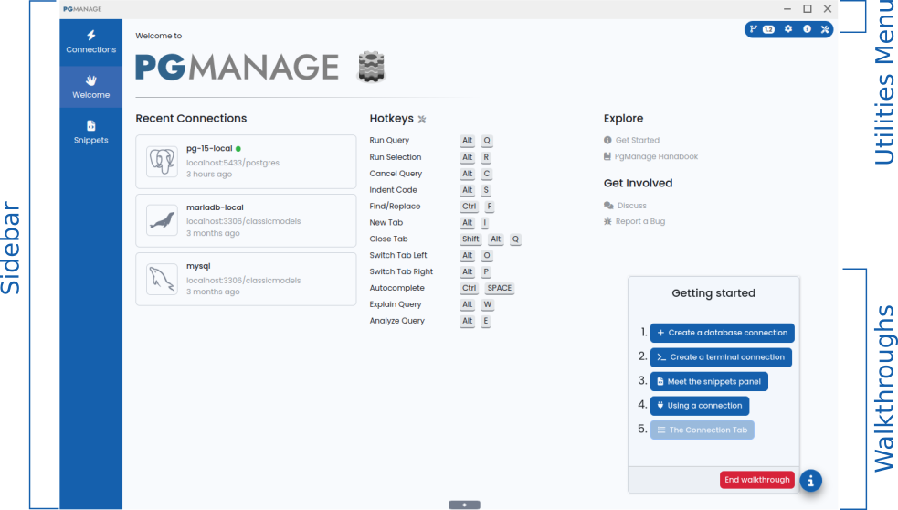

---

## Database Tree and Context Menus

The tree on the left side of workspace displays the objects inside a server once a database session is established.   

Most of tree items have a context menu with a list of actions available for item. The context menu can be accessed by right-clicking on the tree node.


> 💡 The properties of currently selected DB object and it's SQL definition are shown in  **Properties/DDL** tabs at the bottom of DB object tree

## Database Operation Tabs

The area to the right of the Database Tree contains the operation tabs. There are multiple kinds of tabs, the most common are:
  - Query - used to edit and execute queries against the database, view and export query results and analyze query performance.
  - Database Console - shows a command line-like interface for the database
  - Monitoring Dashboard - displays various performance metrics of the database server.
  - Backends - displays a list of active database connections, allows to terminate a particular back-end.

 The tabs listed above can be opened by clicking on the `➕` sign on the tabs panel.

### Query tab

The top area of the tab contains the SQL editor. The toolbar in the middle allows to run most frequently used actions such as running the whole query or its selected part, formatting SQL code, import/export SQL code from files etc. The bottom part of the screen contains the query result data-grid and query plan visualizer (only available for Postgresl).

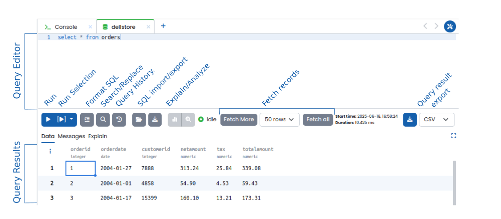

#### Editing the code
The query editor suports syntax highlighting code completion, code folding and formatting for most common SQL dialects.  

The code completion operates in live mode by default, providing suggestions as you type. Live completion may be disabled for the current database connection by toggling the `AB` switch on top of the Database Tree. The autocomplete can also be called with a hotkey (`Ctrl-Space`  or `Cmd-Space` by default).

The code can be auto-formatted either clicking the the **Format SQL** button or with a hotkey (`Alt-S` by default)

>💡 The script in the editor can be saved to a file or loaded from file using the **Save To file** and **Load From File** buttons on the toolbar.  
>💡 SQL scripts can also be imported by draggine the file to the editor

#### Running the query
The query can be executed by clicking the `▶` (Run) button on the toolbar.
The `[▶︎]` (Run Selection) button allows to execute the selected part of the code in the query editor, if no code is selected the code line where the cursor is will be executed. Alternatively, the selected region of the code can be executed via context menu of the editor.

Once query is executed its output will be displayed in the query results data-grid. Query results with more than 50 rows, are loaded in chunks, click `Fetch More` or `Fetch All` respectively to load the next chunk or complete query result; the number of next rows to be fetched can be selected from the drop-down list. 

Query errors returned by the database will be shown as red annotations to the left of the query line which caused error. Hover the mouse pointer over annotation to reveal error details.

#### Working with query results
The contents of query results data grid can be copied to clipboard. First, select the rows, cells or a region of the grid, then right-click on the selection and choose the corresponding option of the context menu.  

>💡 whole rows or columns can be selected  by clickin on the row number or the column name respectively

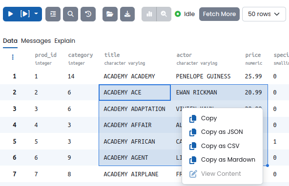

The contents an individual data-grid cell can be viewed in a pop-up window. This is especially useful with cells containing large amounts of data. To view the contents of the cell either double-click on it or select the `View Content` option of its context menu.  

The query result data can be exported to a file by selecting the desired export format in the drop-down (XLSX CSV or JSON) and clicking the `📥`(Export Data) button.

>💡 Data-grid columns can be quickly maximized/minimized by double-clicking the corresponding column header.  
>💡 Hover over the data-grid header to reveal column resize controls.  
>💡 Click on the `⋮` to the left of data-grid header to reveal grid layout menu  


#### Re-running previous queries
PgManage keeps the history of previously executed queries. The history can be searched and filtered by date range and the database against which query was executed.  


Click the `Query History` button to bring up the history modal.  
Right-click on the cell of **Command** column of the history record and select the `Copy Content to Query Tab` context menu option. Alternatively, just double click on the particular cell of the Command column.

#### Visualizing the query execution plan
The query execution plan visualizer can be called by switching to the explain link of the query tab. To run `EXPLAIN ANALYZE` click on the corresponding button on the toolbar. Alternatively the query can be prepended by `EXPLAIN` or `EXPLAIN ANALYZE` keywords and executed. 
  
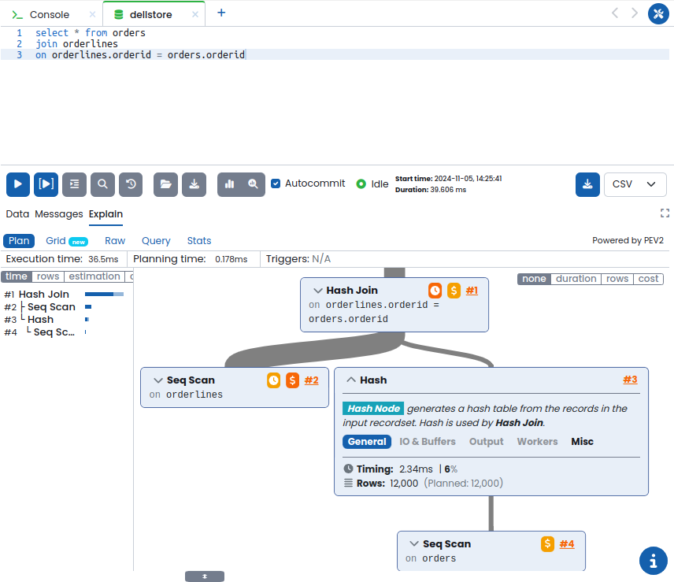

> ℹ️ The Explain functionality is available for PostgreSQL only.


### Console tab

The database console behaves similarly to native database console tools like psql etc. and may be used in scenarios where more "direct" database access is desired.

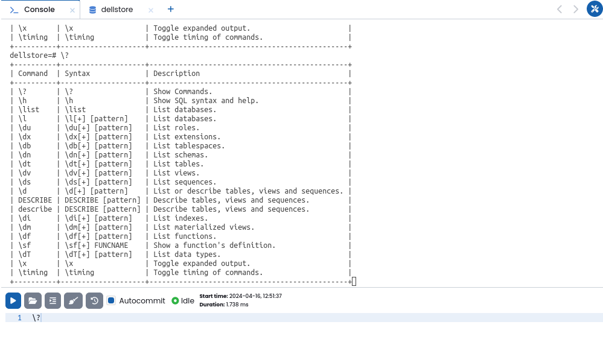

### Monitoring dashboard

The monitoring dashboard displays various database performance metrics in form of graph/chart/grid widgets.
>ℹ️ the monitoring dashboard is available for PostgreSQL, MariaDB, and MySQL only.

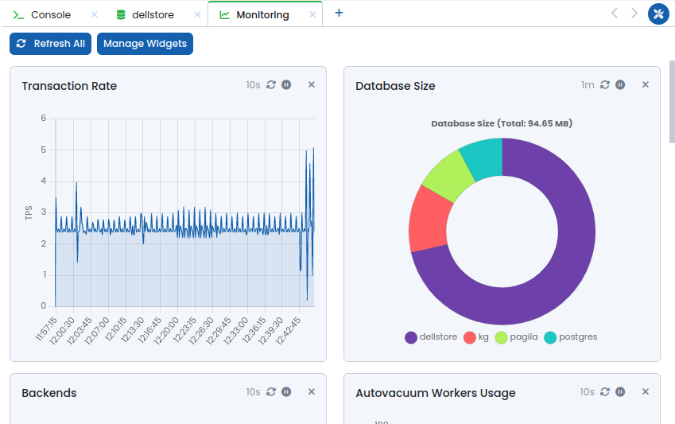  

Displayed widgets can hidden from the dashboard by clicking the `✖` icon of the corresponding widget.  
Widgets refresh their data periodically. The refresh period of each widget can set by clicking on the current refresh period of the widget and selecting the new option from the drop-down.  
Widget auto-refresh can be toggled by clicking the `▶/❚❚` button.

Here is a list of widgets available for PostgreSQL database:

| Widget   | Type  | Description |
| -------- | ----- | ----------- |
| Activity  | Grid | Lists database backends, similar to Backends tab    |
| Autovac Freeze: Top 20 Tables | Grid | Top 20 tables|
| Autovacuum Freeze    | Grid |  Autovacuum freeze percentage |
| Autovacuum Workers Usage | Timeseries | Percentage of busy autovacuum workers on the server |
| Backends | Grid | Number of backends on the server |
| Backends | Chart | Number of backends used per database |
| Bloat: Top 20 Tables | Grid | Lists Top 20 bloated tables for the currently selected database |
| Blocked Locks | Timeseries | Number of blocked locks over time |
| Checkpoints | Timeseries | Number of checkpoints |
| Database Growth Rate | Timeseries | Database growth rate |
| Database Size | Chart | Database sizes for the current server |
| Heap Cache Miss Ratio | Timeseries | Heap Cache Miss Ratio
| In Recovery | Text | Indicates if server is in recovery |
| Index Cache Miss Ratio | Timeseries | Index Cache Miss Ratio
| Long Autovacuum | Timeseries | Long Autovacuum | 
| Long Query | Timeseries | Long Query | 
| Long Transaction | Timeseries | Long Transaction | 
| Seq Scan Ratio | Timeseries | Sequential scan ratio |
| Temp Files Creation Rate | Timeseries | Temp Files Creation Rate |
| WAL Production Rate | Timeseries | WAL Production Rate |
| Transaction Rate | Timeseries | Total number of transactions (commits+rollbacks) over time for the current server |  

Widget visibility, display order and customization can be done in widget management dialog accessible by clicking the `Manage Widgets` button.


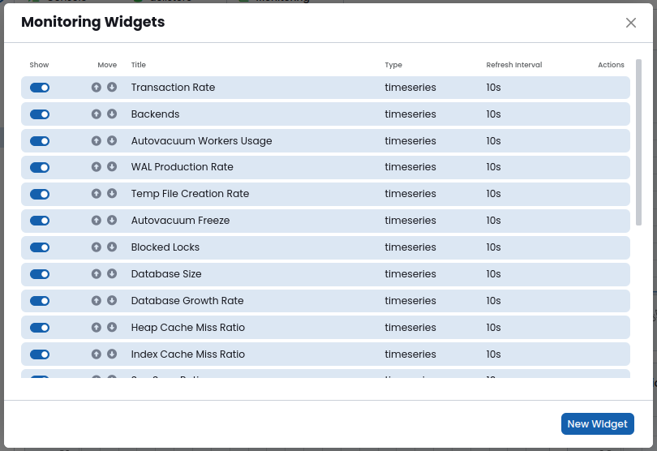  

Custom monitoring widgets may be created by clicking `New Widget` button. This will open a widget editor:


The easiest way to create a new widget is by using an existing one as a template.


### Backends/Process List

This tab displays the list of active database session processes with information such as process id, start time, query, transaction start time, connected user, etc. One can terminate a running back-end process by clicking the `❌` icon.  
>ℹ️ the Backends/Process list tab is available for PostgreSQL, MariaDB, and MySQL only.

---

## Editing Table Data

Table data can be edited in visual format using the Data Editor module. To open data editor right click on the table node in the database-tree and select `Data actions -> Edit Data` from the context menu.

  

A new data editor tab will be shown. By default, the first 10 rows of the query will be fetched with no filters applied.

### Filtering the data
Extra data filtering can be applied by either adding filtering criteria visually or by toggling plain SQL input and entering clause manually.
Click on the funnel button to apply new filter and limit settings.
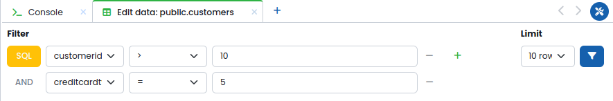  

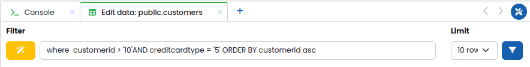

### Making changes


The data editor allows the following changes:
- **Add a row:** Click on the `➕ icon` on the top-left of table header. The new empty row will be added to the top of the grid.
- **Delete a row:** Click on the `❌ icon` next to a row will mark it as a candidate for deletion.
- **Edit cells:** Double-click on a data cell to enter the edit mode, make the changes, click outside the cell to exit from edit mode, hit `Esc` key to discard cell changes.
- **Revert the Changes**: changed table rows are marked with red and orange colors for deleted and edited rows respectively. You can revert the changes by clicking the revert button to the left of the row.

Once the desired changes are done, click on the `Apply changes`.

---

## Creating and Edititng Tables
Database tables can be created and edited in Schema Editor.
To create a new table righ-click on the `Tables` node in DB tree and select `➕ Create Table` menu item.  
To edit an existing table righ-click on it's DB tree node and select `Table Actions -> Alter table` menu item.  

The schema editor tab will be shown
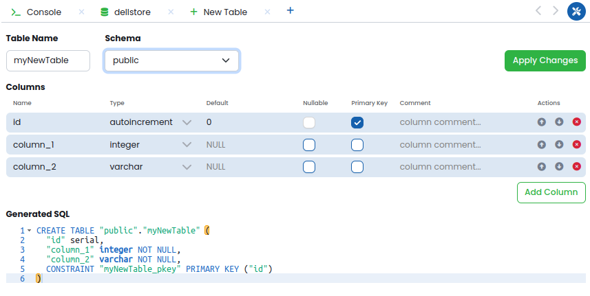

Define table columns, their order and properties.  
The SQL code for operations to be performed will be updated in live mode as you change the table definition.  
Each column item has several action buttons on the right.  
Newly created columns can be reordered by clicking UP and DOWN buttons.
Columns can also be deleted. Newly defined columns will be removed immediately. Existing columns will be marked for deletion (highlighed in red), deletion can be reverted by clicking the revert button.  

Once ready, click the `Apply Changes` to execute the generated SQL code.

>ℹ️ UI controls available in Schema Editor may be different depending on the database type and operation type (create/edit).
>ℹ️ Table indexes can be defined for existing tables only.  

---

## Working With Snippets

The snippets panel can be shown by clicking the `Snippets` icon on the sidebar. To minimze it either click on any other item on the sidebar or click the litte gray tab on the top of snippets panel.

The snippets panel has a tree-view on the left. Here you can view and manage your snippets. The contents of the snippets is displayed and can be edited in the tabs on the right.


To create a new snippet click on the  `➕` icon in the snipped panel tab list or right-click the root node in the snippets tree and select the  `New Snippet` option from the context menu. Write the snippet code in the editor and click the 'Save' button.

To open existing snippet for editing double click its node in the tree.


Snippets can be organized in folders. To create a folder right-click a parent node for the folder in the tree and select the `New Folder` option from context menu.  

>ℹ️ Snippet contents can be saved to file or loaded from file using the correspoding toolbar buttons.

To use a saved snippet, open a query tab and right-click on the query editor. Here you may use, overwrite, or create a snippet.
The snippets can then be used in the query editor by clicking on of the items under the `Use Snippet` context menu section.


---

## PostgreSQL Role Management

Postgres roles can be created and edited in Role Editor.
To create a new role righ-click on the `Roles` node in DB tree and select `➕ Create Role` menu item.  
To edit an existing role righ-click on it's DB tree node and select `Alter Role` menu item.  

The role editor will be shown:

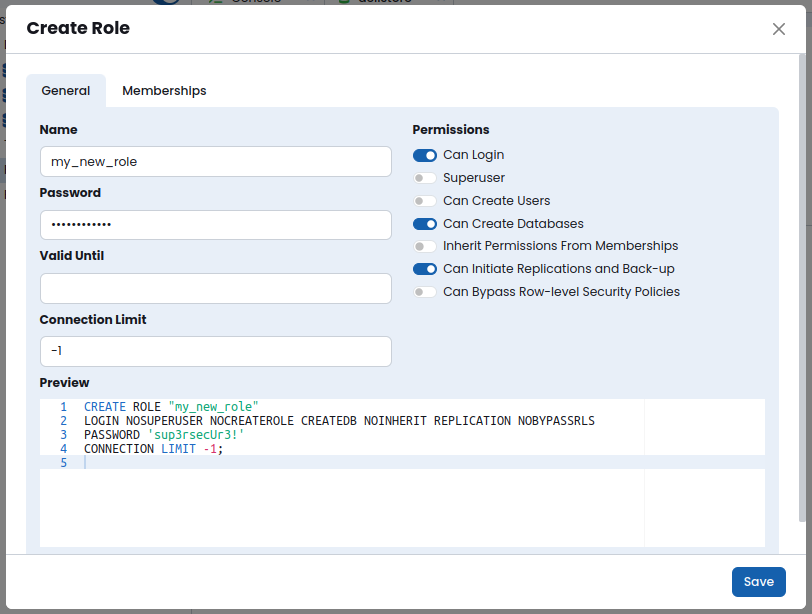  

Here you can define the name of the role, its password, validity date and other attributes.  
The `Memberships` tabe allows to define memberships of this role. Please refer to the official [Postgres Role Membership](https://www.postgresql.org/docs/current/role-membership.html) for details on how role members work.

The SQL code for the role changes will be updated in live mode as you change the table definition.  
Once ready, click the `Save` to execute the generated SQL code.

---

## PostgreSQL Configuration Management

PgManage provides a convenient user interface for PostgreSQL’s `ALTER SYSTEM` set of commands via the `Server Configuration` module. This command is used to change the server’s parameters without having to manually alter the `postgresql.conf` file or running `ALTER SYSTEM` commands.

To open the Server Configuration module, right-click on the server node in the DB entity tree and select `Server Configuration`.


A new tab will open with the server configuration settings. Here you can search for a particular setting, filter available settings by category, the list of matching settings will be automatically displayed. Each list item shows the setting name along with a brief description. Setting value can be changed by entering new value in the corresponding input field. Settings which have non-default values can be reverted to defaults by clicking revert icon of the corresponding setting.  
Once the necessary set of configuration changes is made the changes must be applied by clicking the `Apply` button. A prompt with the list of configuration changes to be made will be shown. Here, you can provide a name for the current configuration snapshot.  
Once committed, the server configuration changes will be applied and the snapshot of the previous configuration should appear in the `Config History` drop-down menu.  
One may return to a previous configuration snapshot by selecting the snapshot from the dropdown menu, clicking the revert button, and confirming the operation.

>ℹ️ PgManage will notify the user if any configuration changes require a PostgreSQL server restart that should be done manually.

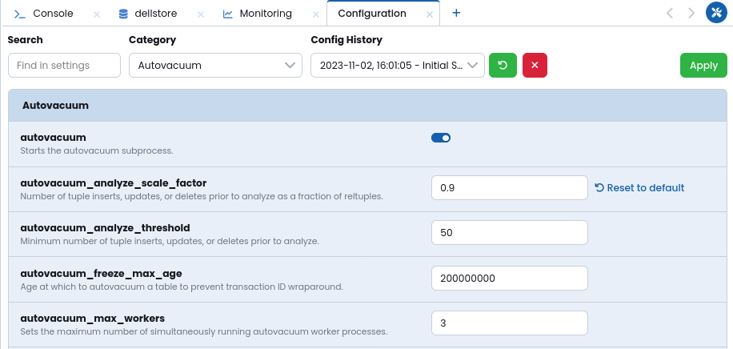

---

## PostgreSQL Extension Management

PostgreSQL Extensions can be managed via the dedicated dialog accessible by right-clicking the `Extensions` node and its subnodes in the DB Object Tree.

  

Click `Create Extension` to open the extension management dialog. Here you can select the extension to be installed, the schema where to install the extension and the extension version. Optionally, you can set the extension comment. A preview of the `CREATE EXTENSION` query will be displayed under the Preview section. Click `Save` button to apply the changes.


Right-clicking on a given extension will display a menu with the following options:

- **Alter Extension:** The `Alter Extension` option will open the management dialog for the selected extension. Here you can alter the properties of the existing extension.


- **Edit Comment:** Displays a template on a new tab with a `COMMENT ON EXTENSION` query.
- **Drop Extension:** The `Drop Extension` will open a prompt confirming if the given extension should be dropped. Cascading can be enabled if desired.


---

## SQL Templates

The application automatically creates a template for actions selected in the DB Entity Tree.
For example, vacuum table template can be created by right-clicking on a table object and selecting `Table Actions → Vacuum table`. For a given table, the following text was generated in a query tab:


Then the templated code in the query editor can be adjusted as needed and executed.

---

## Backup and Restore

PgManage has a convenient user interface for Postgres's [pg_dump](https://www.postgresql.org/docs/current/app-pgdump.html), [pg_dumpall](https://www.postgresql.org/docs/current/app-pg-dumpall.html), and [pg_restore](https://www.postgresql.org/docs/current/app-pgrestore.html) set of commands.  

These features can be accessed by selectin **Backup** or **Restore** options from the DB tree context menu of Server Schema or Table nodes.  

The backup and restore operations run as background jobs, allowing to do other tasks in PgManage without interrupting the process. Once the job completes the notification will be shown.

The backup/restore operations are listed under the `Jobs` section. Here, information such as PID, Type, Server, Object, Start Time, Status, Duration, and Actions will be displayed.

Under the `Actions` column, you may view details about a specific job or delete the job. The information about the job will contain the executed command, the start time, the duration of execution, and the output. The output of currently executing jobs can be viewed live by clicking its View Details icon.


### PIGZ Support
A more performant PIGZ backup compressor is supported on Linux. If desired, PIGZ needs to be installed on the target OS. For example, in Ubuntu, you may install it as follows:

```
sudo apt update -y
sudo apt install -y pigz
```
Next, the path to the PIGZ binaries needs to be specified in `Utilities Menu → Settings → Options → Pigz Binary Path`.


Once installed, toggle Compress with Pigz or Decompress with Pigz switch on the backup/restore screens respectively.

### Backup

PgManage allows you to create backups for a database, a table or the whole server. Database backups can be made in`custom`, `.tar`, `plain`, or `directory` formats. The only format supported for server backups is `plain`.

To create a backup, right-click on the server, database or a table node of the DB entity tree. Then, select `Backup Server` or `Backup` respectively. This will open the following tab:

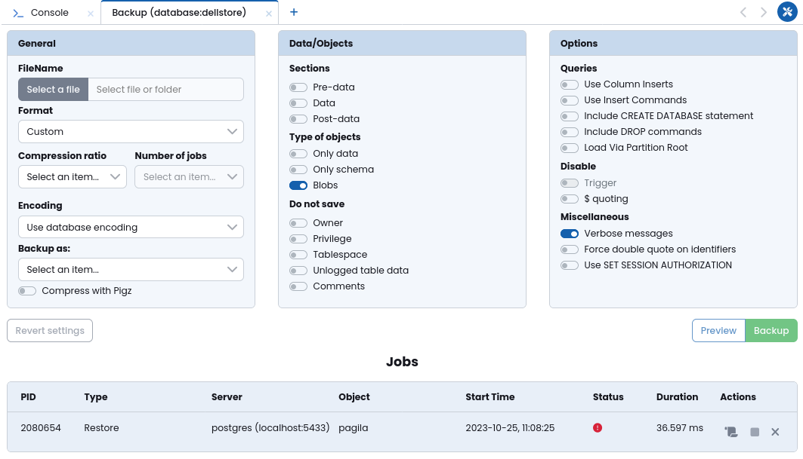

Once the general information is filled out the `Revert settings`, `Preview`, and `Backup` buttons will be made available.
- **Revert settings:** resets the backup dialog settings to their default.
- **Preview:** displays a modal with the command to be executed.
- **Backup:** executes the backup commands as indicated in the form.

### Restore

To restore the server or a database, right-click on the appropriate object on the DB entity tree and select `Restore Server` or `Restore` respectively. A new tab will open with the restore dialog.


Once the general information is filled out the `Revert Settings`, `Preview`, and `Backup` buttons will be made available.
- **Revert settings:** resets the restore dialog settings to their default.
- **Preview:** displays a modal with the command to be executed.
- **Restore:** executes the restore commands as indicated in the form.

---
## pg_cron GUI Instructions

First, install pg_cron extension in your target OS. For example, in Ubuntu, you may install it as follows:

```
sudo apt-get -y install postgresql-[postgres version]-cron
```

Next, add pg_cron to `shared_preload_libraries` in server configuratiom management moule:


Reload postgres configuration to apply the changes:

```
sudo pg_ctlcluster [version] [cluster_name] reload
```
Then, the pg_cron functions and metadata tables can be created.

Add *pg_cron* extension via Extension Manager:  \


Now the new `Jobs` item should be available under the database node:


A new job can be created by right clicking the `Jobs` node, existing jobs can be edited by selecting the ``View/Edit`` option from the job context menu.
In the Job dialog the following options are available:
- **Job Name**
- **Run In Database**: the database against which run the query
- **Run At/Cron expression**: the period for running the job. You can use the Cron schedule widget to define the schedule or click the ``Define manually`` switch and write Cron expression by hand.
- **Command to Run**: the SQL expression to be executed at the specified schedule

When viewing the existing job, the ``Job Statistics`` tab can be used to view last 50 job execution results.


**Important:** By default, pg_cron uses libpq to open a new connection to the local database, which needs to be allowed by pg_hba.conf. It may be necessary to enable trust authentication for connections coming from localhost in for the user running the cron job, or you can add the password to a .pgpass file, which libpq will use when opening a connection. \
Please refer to [official pg_cron documentation](https://github.com/citusdata/pg_cron#ensuring-pg_cron-can-start-jobs) for more details.
