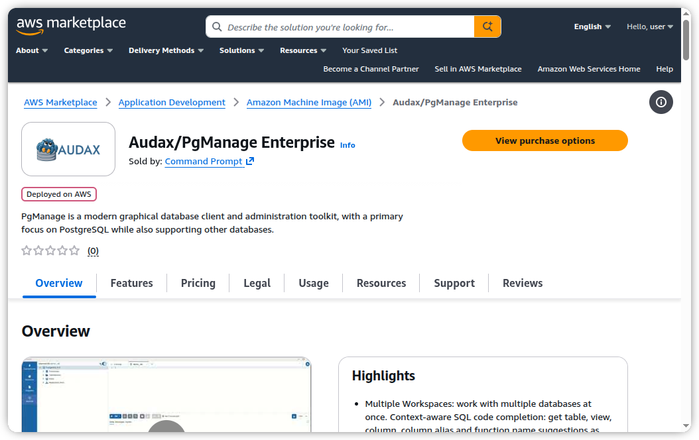
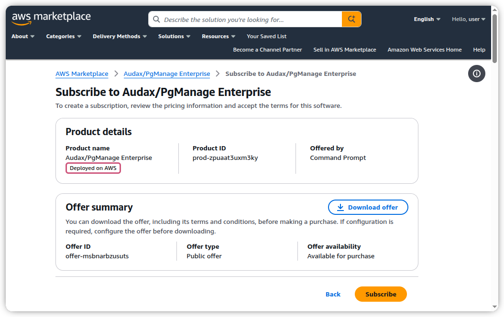
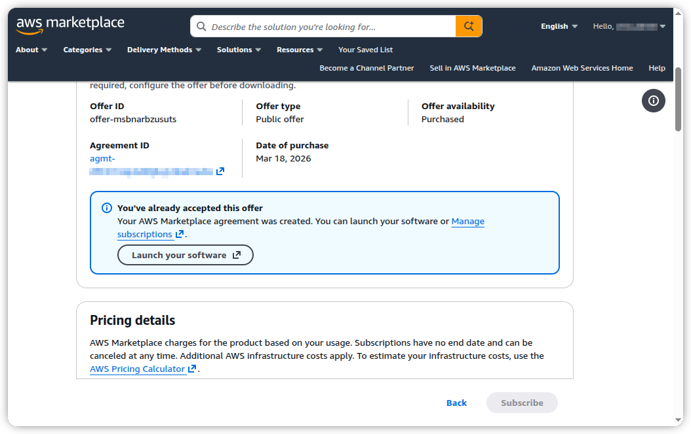
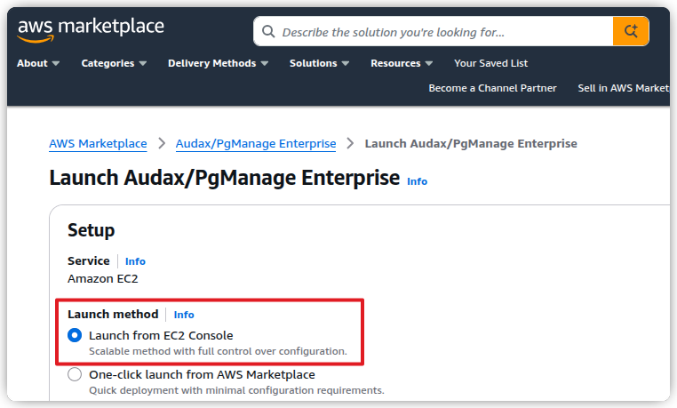
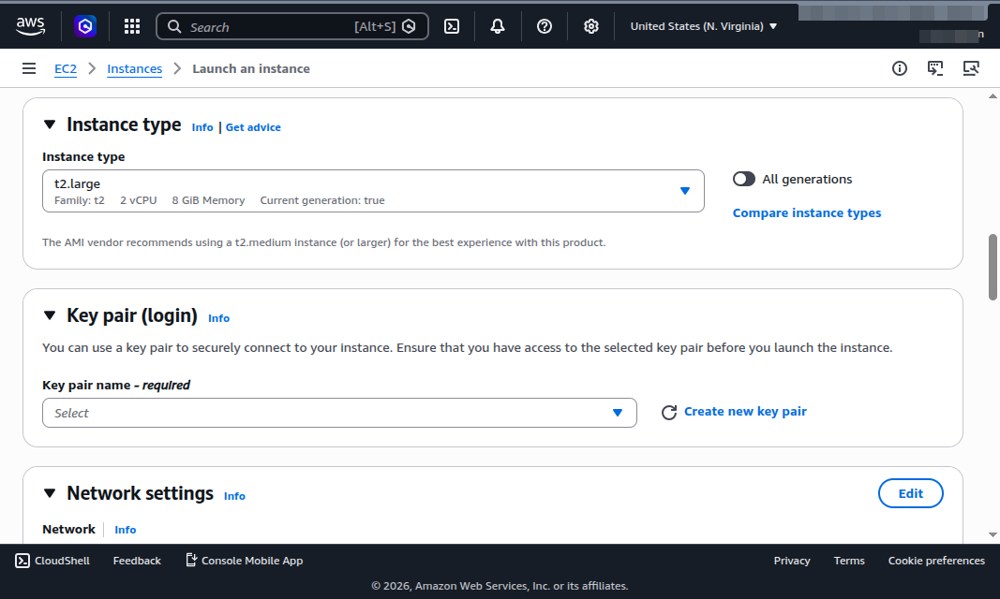
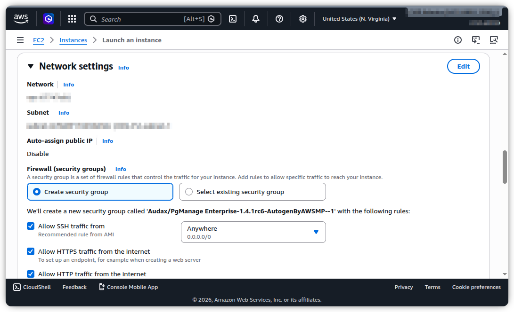
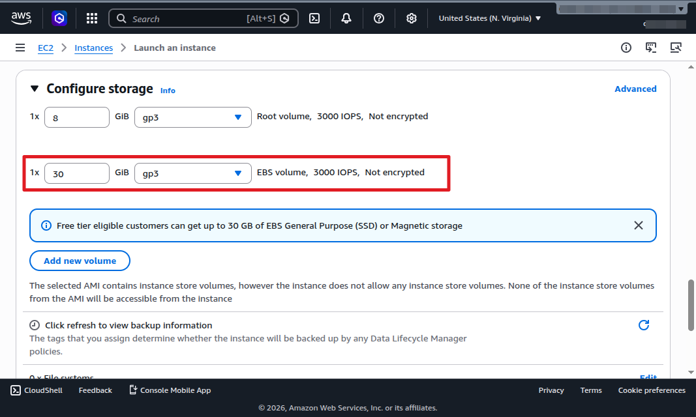
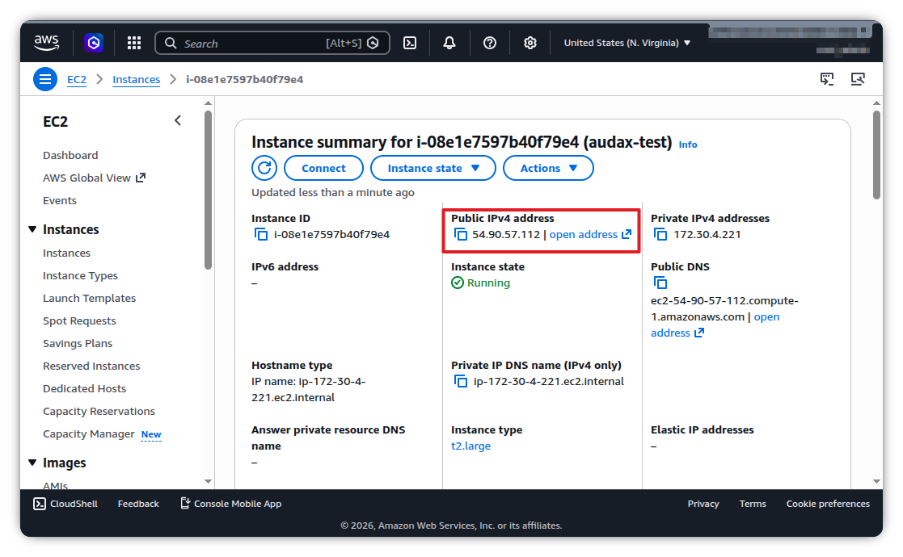

# Audax Enterprise Installation

## Amazon AMI
### Subscribing to the product
Navigate to the Audax AWS Marketplace page <https://aws.amazon.com/marketplace/pp/prodview-rrd472rooejz2>  

Click `View Purchase Options`, to proceed to the subscription page.
  


Click the `Subscribe` button to accept the terms and conditions.  
The subscription activation may take a few moments to complete. Wait for the confirmation message before proceeding.


Once subscription is ready, click `Launch your software`.


Select `Launch from EC2 console` to begin the EC2 instance deployment wizard



### Starting a new instance  
There are several important parameters that must be set when launching a new instance.

Set EC2 instance type (t2.medium or larger is recommended).  
Select or import the SSH keypair that will be used to access Audax instance.


Configure Security Group to allow inbound TCP cunnection to ports 22 (SSH), 80 (HTTP), 443 (HTTPS).  
The default security groups configuration already has the necessary rules.  
**Important:** If you are planning to access Audax Web interface from the internet, ensure that you've selected subnet with public IP addresses


Audax uses a dedicated EBS volume for storing database backups, application logs and other application data.  
**Size the data volume to meet your backup size demands. The recommended size is 30Gb or more.**  
Once all the neccessary parameters were set launch the instance, wait for it to start. 



    
### Initial setup  
Once new instance is running, the setup must be finalized via SSH console.


Obtain instance public IP from the details page


Login to the Audax instance using the SSH keypair selected in the previous step: `ssh ubuntu@<instance-public-ip> `
    
```
ssh ubuntu@instance-public-ip
...
==========================  
Welcome to Audax Enteprise  
==========================  
INSTANCE ID                 i-08e1e7597b40f79e4
PUBLIC IP                   <instance-public-ip>
PUBLIC HOSTNAME             <instance-public-dns-name>
APPDATA MOUNTED             OK
CONFIG PRESENT              FAIL
SERVICE STATUS              STOPPED

Audax config file not found at /appdata/config.py
Run 'sudo /app/audax-setup' to generate a new configuration
```

After login the current instance status and information will be shown.
Run `sudo /app/audax-setup` to generate app configuration

```
ubuntu@audax-host:~$ sudo /app/audax-setup
=== Audax setup ===
App base path: '/app'
App config path: '/appdata/config.py'
See https://pgmanage.readthedocs.io/en/latest/en/05_enterprise.html for details.

SSL enabled? (yes/no, y/n, true/false) [no]: y
Use builtin certs? (yes/no, y/n, true/false) [yes]: 
Listening address (e.g. 127.0.0.1, ::1) [::]: 
Listening port [443]: 
Configure OAuth2 login providers? (yes/no, y/n, true/false) [no]: 
URL path to access Audax (ex. https://instance-public-dns-name/<PATH> leave blank to serve from / ) []: 

=== Setup complete ===

....

An initial admin user account has been created with the following credentials

Login: admin
Password: <instance-id>

IMPORTANT: Change this password after the first login

You can now start using Audax at https://instance-public-dns-name
```

---

> 💡 The setup is complete, you can now login to Audax by visiting the link printed by the setup script.

configuring oauth  

logging into web ui  
    change admin password  
    adding new users  

---

## Docker

Pull the latest Docker image
```
docker pull cmdpromptinc/audax-enterprise:latest
```

### Prerequisites
Before running Audax docker container create the data and certificate directories on the host machine (referred to as /private/appdata and /private/certs in the following examples) and the directory its ownership to UID 900 GID 0 (these are the user and group IDs audax service runs as inside the container)
```
sudo chown -R 900:0 /private/appdata
sudo chown -R 900:0 /private/certs
```
Files in /private/appdata and /private/certs should be accessible by the web service process running as UID 900 inside the container.

### Launch examples

#### Plain HTTP, unlincensed (simplest setup)
```
docker run -p80:80  -v /private/appdata:/appdata cmdpromptinc/audax-enterprise:latest
```

#### SSL Enabled, unlicensed
```
docker run -p443:443 -v /private/appdata:/appdata -v /private/certs:/certs -e AUDAX_SSL_ENABLED=True -e AUDAX_SSL_CERT=/certs/test.pem -e AUDAX_SSL_KEY=/certs/test.key cmdpromptinc/audax-enterprise:latest
```

> ℹ️ this example assumes that you have valid SSL certificate and key files specified in AUDAX_SSL_CERT AUDAX_SSL_KEY variables.

#### SSL Enabled with enterprise feautures
```
docker run -p443:443 -v /private/appdata:/appdata -v /private/certs:/certs -e AUDAX_SSL_ENABLED=True -e AUDAX_SSL_CERT=/certs/test.pem -e AUDAX_SSL_KEY=/certs/test.key -e AUDAX_LICENSE_KEY=XXXXXX-XXXXXX-XXXXXX-XXXXXX-XXXXXX-XX cmdpromptinc/audax-enterprise:latest
```
> ℹ️ this example assumes that you have a valid SSL certificate and key files specified in AUDAX_SSL_CERT AUDAX_SSL_KEY variables.
> ℹ️ this example assumes that you have a valid license file stored in /appdata/pge-license.lic file.  
> ℹ️ set AUDAX_LICENSE_KEY to the actual value provided with your Audax Enterprise license

#### With reverse-proxy and enterprise features
It is possible to run Audax behind a reverse proxy. The following example shows how to set up Audax in a combination with Nginx
```
docker pull cmdpromptinc/audax-enterprise:latest
docker run -p8080:80 -v /private/appdata:/appdata -v /private/certs:/certs -e AUDAX_LICENSE_KEY=XXXXXX-XXXXXX-XXXXXX-XXXXXX-XXXXXX-XX cmdpromptinc/audax-enterprise:latest
```

Nginx configuration:
```
{
    listen 80;
    server_name _;

    location / {
        proxy_set_header Host $host;
        proxy_pass http://localhost:8080/;
        proxy_redirect off;
    }
}
```


### Supported Environment Variables  

`AUDAX_LISTEN_ADDRESS`  
Default: [::]  
The address of the network interface that web service will listen for the connections.  

`AUDAX_LISTEN_PORT`  
Default: 80 (or 443 when SSL is enabled)  
The TCP port that web service will listen for the connections.

`AUDAX_URL_PREFIX`  
Default: None which means that the app is seved from the root URI.
This configuration option allows to serve audax from non-root URLs like https://myhost/audax/

`AUDAX_SSL_ENABLED`  
Default: False  
If False or unset, the application web service will run in plain HTTP mode. In production mode this option is useful in scenarios when the application is served via reverse proxy which handles SSL/TLS.  

> ⚠️ Don't run audax via plain HTTP in standalone mode in production environments.
If SSL enabled, AUDAX_SSL_CERT and AUDAX_SSL_KEY config options must also be set, pointing to the valid certificate and key files.

`AUDAX_SSL_CERT` 
Default: None  
Specifies path to SSL certificate file within the container, required if SSL is enabled.

`AUDAX_SSL_KEY`  
Default: None  
Specifies path to corresponding SSL certificate key within the container, required if SSL is enabled.

`AUDAX_SECURE_COOKIES` 
Default: False (True when SSL is enabled)  
A boolean flag which is used to enable http cookie secure flag, should be set to True if the application runs over plain HTTP with an external SSL-enabled front-end webserver.

`AUDAX_DEFAULT_USERNAME`  
Default: admin  
The login name of the built-in admin user account to be created during the first startup of the application.

`AUDAX_DEFAULT_PASSWORD`  
Default: admin  
The password of the built-in admin user account to be created during the first startup of the application.

`AUDAX_OAUTH2_AUTO_CREATE_USER`  
Default: True  
Tells audax to automatically create local user accounts when authenticating via OAuth2. If not enabled, any users to be authenticated via OAuth2 must be manually created locally by a the application admin before they can log in through the OAuth2 provider.

`AUDAX_LICENSE_KEY`  
Defaut: None  
A key used to decrypt the license file. Must be present to enabled Enterprise features  

`AUDAX_LICENSE_PATH`  
Default: None  
A path to a license file within the container. Optional. By default audax will use **/appdata/audax-license.lic** for the license file path.


### Configuration Overrides File
In some scenarios, passing complex configuration options via environment variables may be impractical. For such cases it is possible to define the configuration in a configuration file (**/appdata/override.py** for Docker deployments) file. OAuth2 Provider configuration is a good example of such a use case.

---

## Setting up OAuth2 Authentication
To enable OAuth2, you must first register your application with your chosen provider. During registration, you will obtain a Client ID and Client Secret, which are required for the final configuration.

Please refer to the specific guides of your OAuth2 provide for details instructions on how to do that:  

### Google

Create a Google OAuth Client  
Go to <https://console.developers.google.com/apis/credentials>  

Select an existing project or create a new one.  
- Configure OAuth consent screen with External User Type.  
- Fill out the requested information use your Audax instance for the URL.  
- Customize other consent screen options if necessary.  
    
In Creadential section Click `+ Create Credentials`, then click `OAuth Client ID` in the dropdown menu  

Fill in the form as follows:  
-  Application Type: Web application  
-  Name: Audax  
-  Authorized JavaScript origins: https://`<AUDAX_URL>`  
-  Authorized redirect URIs: https://`<AUDAX_URL>`/login/google  
-  Replace `<AUDAX_URL>` with the URL of your Audax instance.  

Click `Create`
Copy the Client ID and Client Secret from the **OAuth Client** modal.

Detailed guide: <https://developers.google.com/identity/protocols/oauth2>  

### GitHub

Register a GitHub OAuth App  
-  Log in to your GitHub account.  
-  Go to Profile -> Settings -> Developer settings, select OAuth Apps.  
-  Click `New OAuth App`.  
-  Fill out the form, use your AudaxURL when appropriate.  
-  For the `Authorization callback` URL field use the following: https://`<AUDAX_URL>`/login/github  
-  Copy your Client ID.
-  Generate and copy, your Client Secret.

Detailed guide: <https://docs.github.com/en/apps/oauth-apps/building-oauth-apps/authorizing-oauth-apps>  

Here is a sample configuration using Google OAuth2 provider:
```
OAUTH2_CONFIG = [
    {
        # The name of the of the oauth provider, ex: github, google
        'OAUTH2_NAME': 'Google',
        # Oauth client id
        'OAUTH2_CLIENT_ID': '<YOUR_OAUTH2_CLIENT_ID_HERE>',
        # Oauth secret
        'OAUTH2_CLIENT_SECRET': '<YOUR_OAUTH2_CLIENT_SECRET_HERE>',
        # The claim which is used for the username. If the value is empty the
        # email is used as username, but if a value is provided,
        # the claim has to exist.
        'OAUTH2_USERNAME_CLAIM': None,
        # URL is used for authentication,
        # Ex: https://accounts.google.com/o/oauth2/v2/auth
        'OAUTH2_AUTHORIZATION_URL': 'https://accounts.google.com/o/oauth2/v2/auth',
        # server metadata url might optional for your provider, ex: https://accounts.google.com/.well-known/openid-configuration
        'OAUTH2_SERVER_METADATA_URL': 'https://accounts.google.com/.well-known/openid-configuration',
        # Oauth base url, ex: https://www.googleapis.com/
        'OAUTH2_API_BASE_URL': 'https://www.googleapis.com/',
        # Oauth scope, ex: 'openid email profile'
        # Note that an 'email' claim is required in the resulting profile
        "OAUTH2_SCOPE": 'email',
        # Oauth prompt, ex: 'consent select_account'
        # see https://openid.net/specs/openid-connect-core-1_0.html#AuthRequest for available options
        "OAUTH2_PROMPT": '',
        # The display name, ex: Google
        'OAUTH2_DISPLAY_NAME': 'Google',
        # Font-awesome icon, ex: 'fa-brands fa-github'
        'OAUTH2_ICON': 'fa-brands fa-google',
    },
]
```

Once Audax is restarted with the new configuration, its login screen should display the OAuth2 button.

> ℹ️ It is possible to configure multiple OAuth2 providers for a single Audax instance; just define multiple configuration entries like so
```
OAUTH2_CONFIG = [
    {
        # The name of the of the oauth provider, ex: github, google
        'OAUTH2_NAME': 'Google',
        # Oauth client id
        'OAUTH2_CLIENT_ID': '<YOUR_OAUTH2_CLIENT_ID_HERE>',
        # Oauth secret
        'OAUTH2_CLIENT_SECRET': '<YOUR_OAUTH2_CLIENT_SECRET_HERE>',
        # The claim which is used for the username. If the value is empty the
        # email is used as username, but if a value is provided,
        # the claim has to exist.
        'OAUTH2_USERNAME_CLAIM': None,
        # URL is used for authentication,
        # Ex: https://accounts.google.com/o/oauth2/v2/auth
        'OAUTH2_AUTHORIZATION_URL': 'https://accounts.google.com/o/oauth2/v2/auth',
        # server metadata url might optional for your provider, ex: https://accounts.google.com/.well-known/openid-configuration
        'OAUTH2_SERVER_METADATA_URL': 'https://accounts.google.com/.well-known/openid-configuration',
        # Oauth base url, ex: https://www.googleapis.com/
        'OAUTH2_API_BASE_URL': 'https://www.googleapis.com/',
        # Oauth scope, ex: 'openid email profile'
        # Note that an 'email' claim is required in the resulting profile
        "OAUTH2_SCOPE": 'email',
        # Oauth prompt, ex: 'consent select_account'
        # see https://openid.net/specs/openid-connect-core-1_0.html#AuthRequest for available options
        "OAUTH2_PROMPT": '',
        # The display name, ex: Google
        'OAUTH2_DISPLAY_NAME': 'Google',
        # Font-awesome icon, ex: 'fa-brands fa-github'
        'OAUTH2_ICON': 'fa-brands fa-google',
    },
    {
        # The name of the of the oauth provider, ex: github, google
        'OAUTH2_NAME': 'Another OAuth2 provider',
        # Oauth client id
        'OAUTH2_CLIENT_ID': '<YOUR_OAUTH2_CLIENT_ID_HERE>',
        # Oauth secret
        'OAUTH2_CLIENT_SECRET': '<YOUR_OAUTH2_CLIENT_SECRET_HERE>',
        # The claim which is used for the username. If the value is empty the
        # email is used as username, but if a value is provided,
        # the claim has to exist.
        'OAUTH2_USERNAME_CLAIM': None,
        # URL is used for authentication,
        # Ex: https://accounts.google.com/o/oauth2/v2/auth
        'OAUTH2_AUTHORIZATION_URL': 'https://accounts.google.com/o/oauth2/v2/auth',
        # server metadata url might optional for your provider, ex: https://accounts.google.com/.well-known/openid-configuration
        'OAUTH2_SERVER_METADATA_URL': 'https://accounts.google.com/.well-known/openid-configuration',
        # Oauth base url, ex: https://www.googleapis.com/
        'OAUTH2_API_BASE_URL': 'https://www.googleapis.com/',
        # Oauth scope, ex: 'openid email profile'
        # Note that an 'email' claim is required in the resulting profile
        "OAUTH2_SCOPE": 'email',
        # The display name, ex: Google
        'OAUTH2_DISPLAY_NAME': 'Google',
        # Font-awesome icon, ex: 'fa-brands fa-github'
        'OAUTH2_ICON': 'fa-brands fa-google',
    },
]
```
